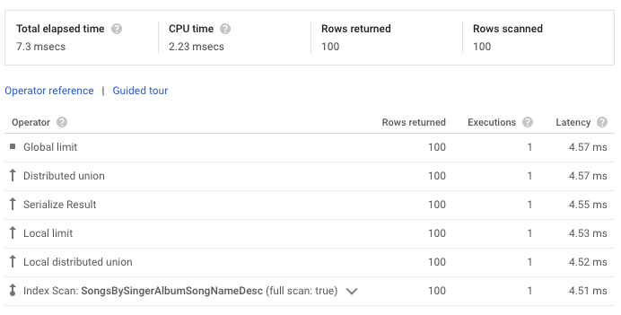

[Query execution operators](https://cloud.google.com/spanner/docs/query-execution-operators?hl=en) にはドキュメンテーションされていない operator もあり、 metadata やそれぞれの child links についてもほぼ解説されていないためここにまとめる。
なお、ドキュメンテーションされていない事柄が多く、間違っていたり今後予告なく変更される可能性がある。

対象: 実行計画を可視化や解析のために処理するツール作成者や、含まれる情報全てをクエリの理解に役立てたいと考えるユーザ

TODO: Metadata や ChildLinks の表の形式化を進める。

## 実行計画の構造

実行計画の実体は [`google.spanner.v1.QueryPlan`](https://cloud.google.com/spanner/docs/reference/rpc/google.spanner.v1?hl=en#queryplan) であり、各クライアントや Web UI が表示するものは REST API や gRPC API の `ExecuteSql` もしくは `ExecuteStreamingSql` API 経由で `QueryMode` に `PLAN` もしくは `PROFILE` を指定することで取得した `QueryPlan` そのものである。

`QueryPlan` は [`PlanNode`](https://cloud.google.com/spanner/docs/reference/rpc/google.spanner.v1?hl=en#plannode) の集合であり、 `PlanNode` は operator と一対一で対応する。
各 `PlanNode` の動作は `display_name` によって特定できる operator の種類と、 operator の動作を変える `metadata` によって決まり、`child_links` に入力として使う子の operator が列挙されている。

実行計画に含まれる operator にはストリームを返す Relational operator の他にも Scalar operator があるが、 Scalar operator の方は親の Relational operator の一部として表示される。


例えば上記の Table Scan operator の実体は [Scan](#scan) operator であり、 `Table Scan: Songs` の部分及び `full scan: true` は metadata からの情報を合わせて表示している。また、デフォルトでは折りたたまれている変数名とスキャン対象の列名の対応関係は全て Scalar operator である。

<details>
<summary>上記 Table Scan に対応する生の PlanNode の YAML 表現</summary>

```yaml
- childLinks:
  - childIndex: 4
    variable: SingerId
  - childIndex: 5
    variable: AlbumId
  - childIndex: 6
    variable: TrackId
  - childIndex: 7
    variable: SongName
  - childIndex: 8
    variable: Duration
  - childIndex: 9
    variable: SongGenre
  displayName: Scan
  index: 3
  kind: RELATIONAL
  metadata:
    Full scan: 'true'
    scan_target: Songs
    scan_type: TableScan
```

</details>

## Relational operators

`kind: RELATIONAL` なもので、行のストリームを返す operator である。

### Distributed operators

分散実行される operator 群であり、 `subquery_cluster_node` が指す方の子の Relational operator からなる実行計画のサブツリーを `Split Range` の条件を満たす remote server で実行するとで、 server を跨ぐ replica から結果を得るという共通点がある。

* https://cloud.google.com/spanner/docs/query-execution-operators?hl=en#distributed_operators

#### Distributed Anti Semi Apply

(Undocumented)
`NOT EXISTS` などを処理するために分散 Anti Semi Join を行う。Distributed Cross Apply と似た構造を持つ。

##### Metadata

| key | values | description |
|-----|--------|-------------|
| subquery_cluster_node | | 分散実行する対象の Relation operator の ID |

##### ChildLinks

|kind      | type | variable? | multiple? | description |
|----------|-----|--------|---|-------------|
|RELATIONAL|(Input) | |  | いわゆる駆動表に対応する入力側のサブツリーであり、実際には type を持たないが Web UI やドキュメント等で Input と表示される。通常 Create Batch を持つ。|
|RELATIONAL| Map |  |  | Input 側の値に応じて分散実行されるサブツリーであり、通常 Batch Scan と Cross Apply を含む。|
|SCALAR    | Split Range |  |  | 分散実行する対象の replica をキーから限定するための Function |
|SCALAR    | Batch | Yes | Yes | Input 側の Batch から生成する行の定義? |

#### Distributed Cross Apply

分散 Apply Join を行う。Input 側の Relational operator から取り出した値を使って、対応する Map 側の Relational operator を適切な replica で実行することで分散 JOIN を実現する。

* https://cloud.google.com/spanner/docs/query-execution-operators?hl=en#distributed-cross-apply

##### Metadata

| key | values | description |
|-----|--------|-------------|
| subquery_cluster_node | | 分散実行する対象の Relation operator の ID |

##### ChildLinks

|kind      | type | variable? | multiple? | description |
|----------|-----|--------|---|-------------|
|RELATIONAL| (Input) | | | いわゆる駆動表に対応する入力側のサブツリーであり、実際には type を持たないが Web UI やドキュメント等で Input と表示される。通常 Create Batch を持つ。|
|RELATIONAL| Map |  | | Input 側の値に応じて分散実行されるサブツリーであり、通常 Batch Scan と Cross Apply を含む。|
|SCALAR    | Split Range |  | | 分散実行する対象の replica をキーから限定するための Function |

#### Distributed Outer Apply

`LEFT OUTER JOIN` などを処理するために分散 OUTER JOIN を行う。Distributed Cross Apply と似た構造を持つ。

* https://cloud.google.com/spanner/docs/query-execution-operators?hl=en#distributed-outer-apply)

##### Metadata

| key | values | description |
|-----|--------|-------------|
| subquery_cluster_node | | 分散実行する対象の Relation operator の ID |

##### ChildLinks

|kind      | type | variable? | multiple? | description |
|----------|-----|--------|---|-------------|
|RELATIONAL| (Input) | | | いわゆる駆動表に対応する入力側のサブツリーであり、実際には type を持たないが Web UI やドキュメント等で Input と表示される。通常 Create Batch を持つ。|
|RELATIONAL| Map |  | | Input 側の値に応じて分散実行されるサブツリーであり、通常 Batch Scan と Cross Apply を含む。|
|SCALAR    | Split Range |  | | 分散実行する対象の replica をキーから限定するための Function |
|SCALAR    | Batch | Yes | Yes | 結合条件を満たさなかった時に Input 側の Batch から生成する行の定義 |


#### Distributed Semi Apply

(Undocumented)
`EXISTS` などを処理するために分散 Semi Join を行う。Distributed Cross Apply と似た構造を持つ。

##### Metadata

| key | values | description |
|-----|--------|-------------|
| subquery_cluster_node | | 分散実行する対象の Relation operator の ID |

##### ChildLinks

|kind      | type | variable? | multiple? | description |
|----------|-----|--------|---|-------------|
|RELATIONAL| (Input) | | | いわゆる駆動表に対応する入力側のサブツリーであり、実際には type を持たないが Web UI やドキュメント等で Input と表示される。通常 Create Batch を持つ。|
|RELATIONAL| Map |  | | Input 側の値に応じて分散実行されるサブツリーであり、通常 Batch Scan と Cross Apply を含む。|
|SCALAR    | Split Range |  | | 分散実行する対象の replica をキーから限定するための Function |
|SCALAR    | Batch | Yes | Yes | Input 側の Batch から生成する行の定義? |

#### Distributed Union

各 replica で子の Relation operator を実行し、結果をまとめる。
クエリ対象の replica を他の server(remote server) が持つ場合、remote server を呼び出すため remote call が発生し、 `executionStats` に記録される`。
`call_type` が Local なものは、特定の server 内の結果をまとめる。

* https://cloud.google.com/spanner/docs/query-execution-operators?hl=en#distributed-cross-apply

##### Metadata
| key | values | description |
|-----|--------|-------------|
| call_type | Local, 未指定 ||
| subquery_cluster_node | | 分散実行する対象の Relation operator の ID |

##### ChildLinks

|kind      | type | variable? | multiple? | description |
|----------|-----|--------|---|-------------|
|RELATIONAL|  | | | 入力として分散実行されるサブツリー |
|SCALAR    | Split Range |  | | 分散実行する対象の replica をキーから限定するための Function |

### Leaf operators

Relational operator の子を持たない Relational operator 群。

#### Array Unnest

配列の値と添字を元に Relation を作り出す operator。

* https://cloud.google.com/spanner/docs/query-execution-operators?hl=en#array-unnest

##### ChildLinks

|kind      | type | variable? | multiple? | description |
|----------|-----|--------|---|-------------|
|SCALAR    | | Yes | | 配列の値に対応する変数名を指示する |
|SCALAR    | | Yes | | 配列の添字に対応する変数名を指示する |

#### Empty Relation

空の Relation を生成する。`LIMIT 0` を指定した際には常に結果は 0 行で何も Scan 等の入力をする必要がないが、 Relation operator ではある必要があるので使われる。

* https://cloud.google.com/spanner/docs/query-execution-operators?hl=en#empty-relation

##### ChildLinks

|kind      | type | variable? | multiple? | description |
|----------|-----|--------|---|-------------|
|SCALAR    |  | | | 0 を意味する Constant |

#### Scan

各入力からのスキャンを行う。`PlanNode.displayName` としては Scan だが、一般的に `scan_type` の値と合わせて Index Scan, Table Scan などと表示される。

* https://cloud.google.com/spanner/docs/query-execution-operators?hl=en#scan

##### Metadata

| key | values | description |
|-----|--------|-------------|
| Full scan | true もしくは未指定 ||
| scan_target | | スキャン対象の名前を指示する。 |
| scan_type | IndexScan, TableScan, SpoolScan, BatchScan | スキャン対象の種類を指示する。 |

##### ChildLinks

|kind      | type | variable? | multiple? | description |
|----------|-----|--------|---|-------------|
|SCALAR    |  | Yes | Yes | スキャン対象の列を表現する |

#### Unit Relation

特に値を持たない単一の行を生成する。 Unit Relation を受ける Compute や Serialize Result で実際の列の値が設定される。
例: `SELECT 42`, `SELECT 42 UNION ALL SELECT 43`

* https://cloud.google.com/spanner/docs/query-execution-operators?hl=en#unit-relation

##### Child Links

|kind      | type | variable? | multiple? | description |
|----------|-----|--------|---|-------------|
|SCALAR    | | | Yes | `1` を表現する Constant が常に指定される。|

### Unary operators

Relational operator の子を1つだけ持つ Relational operator 群。

#### Aggregate

`GROUP BY` に対応する集約を行う。
入力がインデックス等で既にソート済であり、その順序で集約することでハッシュテーブルを使わなくて良い時は `call_type` が Stream となり Stream Aggregate と呼ばれる。

* https://cloud.google.com/spanner/docs/query-execution-operators?hl=en#aggregate

##### Metadata

| key | values | description |
|-----|--------|-------------|
| call_type | Local もしくは Global | |
| iterator_type| Stream か未指定 | Stream か Hash による処理方法の区別を示す。|
| scalar_aggregate| true か未指定 | |

##### ChildLinks

|kind      | type | variable? | multiple? | description |
|----------|-----|--------|---|-------------|
|RELATIONAL|  |  | | 入力 |
|SCALAR    | Key | Yes | Yes | `scalar_aggregate=true` の時には存在しない。集約に使うキーを示す。|
|SCALAR    | Agg| Yes | Yes |Aggregate 対象の値を示す。|

#### Apply Mutations

DML である `INSERT`, `UPDATE`, `DELETE` を処理する。サブツリーから row として取得した主キーと更新後の値を適用すると考えられるが、どの列をどのような式で更新するかのような定義は実行計画上は見えない。

* https://cloud.google.com/spanner/docs/query-execution-operators?hl=en#aggregate

##### Metadata

| key | values | description |
|-----|--------|-------------|
| operator_type | INSERT, UPDATE, DELETE | |
| table | | 更新対象のテーブル |

##### ChildLinks

|kind      | type | variable | multiple? | description |
|----------|-----|--------|---|-------------|
|RELATIONAL|  |  | | 入力 |

#### BloomFilterBuild

(Undocumented)
Bloom Filter を構築する。通常 Hash Join の Build 側に現れる。後に `BLOOM_FILTER_MATCH` を Condition に持つ Filter で使われる。

##### ChildLinks

|kind      | type | variable? | multiple? | description |
|----------|-----|--------|---|-------------|
|RELATIONAL| | | |入力 |

#### Compute

入力のそれぞれの行に対して新しい列を追加する。

* https://cloud.google.com/spanner/docs/query-execution-operators?hl=en#compute_struct

##### ChildLinks

|kind      | type | variable? | multiple? | description |
|----------|-----|--------|---|-------------|
|RELATIONAL| | | | 入力 |
|SCALAR    | | Yes | Yes | 新しく計算する値を示す |

#### Compute Struct

入力のそれぞれの行に対して STRUCT を生成する。 Compute Batch の入力や `AS STRUCT` を使ったサブクエリなどで現れる。

* https://cloud.google.com/spanner/docs/query-execution-operators?hl=en#compute_struct

##### ChildLinks

|kind      | type | variable? | multiple? | description |
|----------|-----|--------|---|-------------|
|RELATIONAL| | | | 入力 |
|SCALAR    | | Yes | Yes | STRUCT の各フィールドを表す |
|SCALAR    | Scalar | | Yes | 式で参照される Scalar Subquery(or Array Subquery) を指す。 |

#### Create Batch

入力から batch を作成する。主に Distributed Cross Apply で入力をまとめて対応する replica に送り、 Batch Scan で参照するために使われる。

* https://cloud.google.com/spanner/docs/query-execution-operators?hl=en#create_batch

##### ChildLinks

|kind      | type | variable | multiple? | description |
|----------|-----|--------|---|-------------|
|RELATIONAL| | | | 入力 |
|SCALAR    | | variable | | batch の名前を指定する |

#### Filter

Scan とは独立して任意の箇所で `Condition` 述語で行をフィルタする。フィルタプッシュダウンができないようなサブクエリの外側の WHERE や、 GROUP BY の結果に対して適用する必要がある HAVING は FilterScan ではなく Filter として処理される。

* https://cloud.google.com/spanner/docs/query-execution-operators?hl=en#filter

##### ChildLinks

|kind      | type | variable | multiple? | description |
|----------|-----|--------|---|-------------|
|RELATIONAL|  | | | フィルタの入力となる Scan |
|SCALAR    | Condition |  | | 入力からフィルタする Function |

#### FilterScan

Scan のすぐ上に位置し、スキャンに伴って処理できるフィルタを行う。Scan の一部として働くため `executionStats` を持たず、実行時の挙動は Scan 側の `rows`, `filtered_rows` などを通して確認できる。

* https://cloud.google.com/spanner/docs/query-execution-operators?hl=en#filter_scan

##### ChildLinks
|kind      | type | variable? | multiple? | description |
|----------|-----|--------|---|-------------|
|RELATIONAL|  | | | フィルタの入力となる Scan |
|SCALAR    | Seek Condition |  | | スキャン対象のキー範囲を絞るシークに使う Function であり、 [アクセス述語](https://use-the-index-luke.com/ja/sql/where-clause/searching-for-ranges/greater-less-between-tuning-sql-access-filter-predicates)に対応する。|
|SCALAR    | Residual Condition |  | | スキャン後のフィルタに使う Function であり、[フィルタ述語](https://use-the-index-luke.com/ja/sql/where-clause/searching-for-ranges/greater-less-between-tuning-sql-access-filter-predicates)に対応する。 |

#### Limit

Limit のみを行う。 `ORDER BY` を指定しないか、キー順と一致する順序で指定して `LIMIT` を指定した際に現れる。

* https://cloud.google.com/spanner/docs/query-execution-operators?hl=en#limit

##### Metadata

| key | values | description |
|-----|--------|-------------|
| call_type | Local もしくは Global ||

##### ChildLinks

|kind      | type | variable | multiple? | description |
|----------|-----|--------|---|-------------|
|RELATIONAL|  | | | ソート対象の入力 |
|SCALAR    | Limit |  | | 取得する行数を指定する |
|SCALAR    | Offset |  | | `OFFSET` 指定時に読み飛ばす行数を指定する |

#### MiniBatchAssign

(Undocumented)
MiniBatchKeyOrder より下にある以外はよく分かっていない。

[Shard 最適化クエリ](https://github.com/gcpug/nouhau/blob/spanner/shard/spanner/note/shard/README.md#v3) などで確認されている。

##### ChildLinks

|kind      | type | variable? | multiple? | description |
|----------|-----|--------|---|-------------|
|RELATIONAL|  | | | 入力となる Relation operator。 |
|SCALAR    |  | | | Scalar operator。バッチサイズを指示している？ |

#### MiniBatchKeyOrder

(Undocumented)

MiniBatchAssign より上にある以外はよく分かっていない。

[Shard 最適化クエリ](https://github.com/gcpug/nouhau/blob/spanner/shard/spanner/note/shard/README.md#v3) などで確認されている。

##### ChildLinks

|kind      | type | variable? | multiple? | description |
|----------|-----|--------|---|-------------|
|RELATIONAL|  | | | 入力となる Relation operator。 |

#### Minor Sort

(Undocumented)

ストリームの一部に対して ORDER BY の処理をする。Sort とほぼ同じだが、テーブルやインデックスとソート順の prefix が一致して全体の Sort が必要ない場合に使われる。

##### Metadata

| key | values | description |
|-----|--------|-------------|
| call_type | Local もしくは Global ||

##### ChildLinks

|kind      | type | variable? | multiple? | description |
|----------|-----|--------|---|-------------|
|RELATIONAL|  | | | ソート対象の入力となる Relation operator。 |
|SCALAR    | MajorKey | Yes | Yes | ソートキーのうち、入力でソート済な部分が順に指定される。 |
|SCALAR    | MinorKey | Yes | Yes | ソートキーのうち、入力でソートされていない部分が順に指定される。 |
|SCALAR    | Value | Yes | Yes | ソートキー以外で取り出す列が順に指定される。 |

#### Minor Sort Limit

(Undocumented)

ORDER BY と LIMIT 両方の処理をする operator。Sort Limit とほぼ同じだが、テーブルやインデックスとソート順の prefix が一致して全体の Sort が必要ない場合に使われる。

##### Metadata

| key | values | description |
|-----|--------|-------------|
| call_type | Local もしくは Global ||

##### ChildLinks

|kind      | type | variable? | multiple? | description |
|----------|-----|--------|---|-------------|
|RELATIONAL|  | | | ソート対象の入力 |
|SCALAR    | Limit |  | | 取得する行数 |
|SCALAR    | MajorKey | Yes | Yes | ソートキーのうち、入力でソート済な部分が順に指定される。 |
|SCALAR    | MinorKey | Yes | Yes | ソートキーのうち、入力でソートされていない部分が順に指定される。 |
|SCALAR    | Value | Yes | Yes | ソートキー以外で取り出す列が順に指定される。 |


#### Random Id Assign

(Undocumented)

`TABLESAMPLE` を使用した際に現れる。 Filter operator と組み合わせることで、ランダムに割り当てた値を元にフィルタすることでサンプリングを実現する。
なお Sample について言及されている[ドキュメント](https://cloud.google.com/spanner/docs/query-execution-operators?hl=en#sample)のクエリがこの operator になるため、ドキュメントの解説が古い可能性が高い。

##### ChildLinks

|kind      | type | variable? | multiple? | description |
|----------|-----|--------|---|-------------|
|RELATIONAL|  | | | 入力 |
|SCALAR    |  | Yes | | description が `<random id>` となる Reference を指す variable であり、後に Filter で名前が参照される。 |

#### RowCount 

(Undocumented)

[Shard 最適化クエリ](https://github.com/gcpug/nouhau/blob/spanner/shard/spanner/note/shard/README.md#v3) などで確認されている。

##### ChildLinks

|kind      | type | variable | position | description |
|----------|-----|--------|---|-------------|
|RELATIONAL|  | | | 入力 |

#### Serialize Result

最終的に ResultSet に含まれる値を組み立てる。これよりも上の operator で row の値を操作することはない。Compute Struct の特殊なケースであることが公式ドキュメントでも説明されている通り、同様の構造を持つ。

* https://cloud.google.com/spanner/docs/query-execution-operators?hl=en#serialize_result

##### ChildLinks 

|kind      | type | variable? | multiple? | description |
|----------|-----|--------|---|-------------|
|RELATIONAL|  | | | 入力 |
|SCALAR    |  | | Yes | `metadata.rowType.fields` に現れる順で対応する式を表現する |
|SCALAR    | Scalar | | Yes | 式で参照される Scalar Subquery(or Array Subquery) を指す。 |

#### Sort

`ORDER BY` によるソートのみをする operator。Sort Limit とほぼ同じだが、 `LIMIT` を設定しない場合はこちらになる。

* https://cloud.google.com/spanner/docs/query-execution-operators?hl=en#sort

##### ChildLinks 

|kind      | type | variable? | multiple? | description |
|----------|-----|--------|---|-------------|
|RELATIONAL|  | | | ソート対象の入力 |
|SCALAR    | Key | Yes | Yes | ソートキーとなる列が Reference で順に指定される。 |
|SCALAR    | Value | Yes | Yes | ソートキー以外で取り出す列が Reference で順に指定される。 |

#### Sort Limit

ORDER BY と LIMIT 両方の処理をする operator。Sort とほぼ同じだが、 `LIMIT` を使う場合はこちらになる。

* https://cloud.google.com/spanner/docs/query-execution-operators?hl=en#sort

##### Metadata

| key | values | description |
|-----|--------|-------------|
| call_type | Local もしくは Global ||

##### ChildLinks

|kind      | type | variable? | multiple? | description |
|----------|-----|--------|---|-------------|
|RELATIONAL|  | | | ソート対象の入力 |
|SCALAR    | Limit |  | | 取得する行数 |
|SCALAR    | Offset |  | | 読み飛ばす行数 |
|SCALAR    | Key | Yes | Yes | ソートキーが順に指定される。 |
|SCALAR    | Value | Yes | Yes | ソートキー以外で取り出す列が順に指定される。 |

#### SpoolBuild

(Undocumented)
`WITH` などによる一時テーブルを保存する。 Spool Scan によって読み取られる。

##### Metadata

| key | values | description |
|-----|--------|-------------|
| spool_name | | 構築する spool の名前 |

##### ChildLinks

|kind      | type | variable? | multiple? | description |
|----------|-----|--------|---|-------------|
|RELATIONAL|  | | | 保存対象の入力 |
|SCALAR    |  |  | | 一時テーブルの列 |

#### Union Input

Union All operator のそれぞれの枝からの入力を揃えるための operator。

* https://cloud.google.com/spanner/docs/query-execution-operators?hl=en#union_input

##### ChildLinks

|kind      | type | variable? | multiple? | description |
|----------|-----|--------|---|-------------|
|RELATIONAL|  |  | | それぞれの枝の本体 |
|SCALAR    | `input_{n}` |  | | Union All operator の結果の n 列目となる式 |

### Binary operators

Relational operator の子を2つ持つ Relational operator 群。

#### Cross Apply

replica 内にローカルな Apply Join を行う。Input 側の Relational operator から取り出した値を使って、対応する Map 側の Relational operator を実行することで JOIN を実現する。
主に Distributed Cross Apply の中で使われる場合と、 INTERLEAVE されたテーブル間の JOIN で使われる場合がある。

* https://cloud.google.com/spanner/docs/query-execution-operators?hl=en#cross-apply

##### ChildLinks

|kind      | type | variable | multiple? | description |
|----------|-----|--------|---|-------------|
|RELATIONAL| (Input) | | | いわゆる駆動表となる入力側のサブツリーであり、実際には type を持たないが Web UI やドキュメント等で Input と表示される。|
|RELATIONAL| Map |  | | Input 側の値に応じて実行されるサブツリー |

#### Hash Join

ハッシュ結合を行う。
Build 側の全 row を元にハッシュマップを構築してから Probe 側の各 row の値を使ってハッシュマップを引くことで Condition を評価して JOIN を行う。

* https://cloud.google.com/spanner/docs/query-execution-operators?hl=en#hash-join

##### Metadata

| key | values | description |
|-----|--------|-------------|
| join_type | INNER, BUILD_OUTER, PROBE_OUTER, BUILD_SEMI, BUILD_ANTI_SEMI, ... | INNER 以外は Build と Probe がどちらかで意味が変わるので、 BUILD か PROBE が prefix になる。|

##### ChildLinks

|kind      | type | variable | multiple? | description |
|----------|-----|--------|---|-------------|
|RELATIONAL| Build |  | | 構築するハッシュマップ側になるサブツリー |
|RELATIONAL| Probe |  | | ハッシュマップに通す側のサブツリー |
|SCALAR    | Condition |  | | JOIN 条件のうち、ハッシュテーブルを使える等値の条件を表す Function |
|SCALAR    | Residual Condition |  | | JOIN 条件のうち、ハッシュテーブルを使えない非等値の条件を表す Function |
|SCALAR    | Build | Yes | Yes | Build 側からハッシュマップに含める列を指定 |
|SCALAR    | Probe | Yes | Yes | Probe 側から variable を定義 |

#### Outer Apply

replica 内にローカルな Outer Apply Join を行う。Input 側の Relational operator から取り出した値を使って、対応する Map 側の Relational operator を実行することで JOIN を実現する。
主に Distributed Outer Apply の中で使われる場合と、 INTERLEAVE されたテーブル間の JOIN で使われる場合がある。

* https://cloud.google.com/spanner/docs/query-execution-operators?hl=en#outer-apply

##### ChildLinks

|kind      | type | variable | multiple? | description |
|----------|-----|--------|---|-------------|
|RELATIONAL| (Input) | | | いわゆる駆動表となる入力側のサブツリーであり、実際には type を持たないが Web UI やドキュメント等で Input と表示される。|
|RELATIONAL| Map |  | | Input 側の値に応じて実行されるサブツリー |
|SCALAR    | | Yes | * | 結合条件を満たさなかった時に Input 側から生成する行の定義 |

### N-ary operators

任意の数の Relational operator の子を持つ Relational operator 群。`Union All` 以外確認されていない。

#### Union All

`UNION ALL` を表現する operator で、任意の数の子の Union Input が返す行を合わせて返す。

* https://cloud.google.com/spanner/docs/query-execution-operators?hl=en#union_all

##### ChildLinks

|kind      | type | variable? | multiple? | description |
|----------|-----|--------|---|-------------|
|RELATIONAL|  |  | Yes | UNION 対象を指す任意個数の Union Input operator |
|SCALAR    |  | Yes | Yes | Union All operator の結果の n 列目の名前を持ち、 `input_{n}` と対応付ける Scalar operator |

## Scalar operators

`kind: SCALAR` なもので、 `ARRAY` を含む値として評価されるサブクエリや式などを含む operator である。

### Subqueries

サブクエリは1つの Relational operator を子に持ち、 ARRAY やスカラに変換する Scalar operator として処理される。[Scalar subqueries](https://cloud.google.com/spanner/docs/query-execution-operators?hl=en#scalar_subqueries) で説明されているように最適化の結果 Cross Apply などで実現されることもある。

#### Array Subquery

子のサブクエリと式から配列を計算する。

* https://cloud.google.com/spanner/docs/query-execution-operators?hl=en#array_subqueries

##### Child Links

|kind      | type | variable? | multiple? | description |
|----------|-----|--------|---|-------------|
|RELATIONAL| | | | サブクエリとなるサブツリーで中で variable を定義する。 |
|SCALAR    | | | | サブクエリの中の variable を参照する式。サブクエリの各 row に対して配列の要素を計算するために使われる。 |

#### Scalar Subquery

子のサブクエリと式からスカラ値を計算する。

* https://cloud.google.com/spanner/docs/query-execution-operators?hl=en#unit-relation

##### Child Links

|kind      | type | variable? | multiple? | description |
|----------|-----|--------|---|-------------|
|RELATIONAL| | | | サブクエリとなるサブツリーで、中で variable を定義する。 |
|SCALAR    | | | | サブクエリの中の variable を参照する。 |

### その他の Scalar operators

実行計画の内部表現としてはグラフ構造をなしているが、 Subquery と違って一般的にグラフとしては表示されず、ドキュメンテーションもされていない。

#### Array Constructor

(Undocumented)
配列リテラルに対応し、配列値を表現する。
`shortRepresentation.description` は配列のリテラル表記となる。

##### Child Links

|kind      | type | variable? | multiple? | description |
|----------|-----|--------|---|-------------|
|SCALAR    | | | Yes | 配列の各値を表現する式。 |

#### Constant

(Undocumented)
定数を表す。`shortRepresentation.description` に値のリテラル表記や `<typed null>` などが文字列として入っている。

#### Function

(Undocumented)
演算式と関数呼び出しを含む関数を表現する。`shortRepresentation.description` に演算子や関数名を含む式が文字列として入っている。

##### Child Links

|kind      | type | variable? | multiple? | description |
|----------|-----|--------|---|-------------|
|SCALAR    | | | Yes | 各オペランド |

#### Parameter

(Undocumented)
クエリパラメータに対応する Scalar operator であり、実行時に `Statement.params` の name metadata と一致する名前の値として評価される。

通常はパラメータはスカラ値である前提でクエリが評価されるので、 [Working with STRUCT objects](https://cloud.google.com/spanner/docs/structs?hl=en) にあるような配列や構造体型のパラメータを使うクエリは `param_types` に型を渡さないとエラーとなり、実行計画の取得はできない点に注意する必要がある。

##### Metadata

| key | values | description |
|-----|--------|-------------|
| name |  | パラメータ名 |
| type | array, scalar, ... | クエリパラメータが配列かスカラ値かを示す。 `STRUCT` 型の値も `scalar` となる。 |

#### Reference

(Undocumented)
`shortRepresentation.description` に名前を持つ参照で metadata も子も持たない。
Sort 系の operator の Key で降順の場合は `shortRepresentation.description` に `$ItemId (DESC)` のように `(DESC)` が含まれる。 

#### Struct Constructor

`shortRepresentation.description` は `Struct Constructor {FirstName:DECODE_STRUCT_FIELD(0, $v1);LastName:DECODE_STRUCT_FIELD(1, $v1)}` のように、フィールド名とフィールドの式を列挙する形式となる。
フィールド値の式は `childLinks` で参照できるがフィールド名は `shortRepresentation.description` にしか含まれない。

* https://cloud.google.com/spanner/docs/query-execution-operators?hl=en#struct_constructor

##### Child Links

|kind      | type | variable? | multiple? | description |
|----------|-----|--------|---|-------------|
|SCALAR    | | | Yes | 各フィールド値 |

## QueryPlan=PROFILE の構造



上記のような実行統計は `QueryMode=PROFILE` でクエリを実行した際に付与される情報の一部をレンダリングしている。上部に表示されるクエリ全体の実行統計は [ResultSetStats.queryStats](https://cloud.google.com/spanner/docs/reference/rest/v1/ResultSetStats?hl=en), 下部の各 operator ごとに表示されている統計は [PlanNode.executionStats](https://cloud.google.com/spanner/docs/reference/rest/v1/ResultSetStats?hl=en#PlanNode) を元の情報としている。

<details>
<summary>QueryPlan=PROFILE 時のレスポンスの YAML 表現からの抜粋</summary>

```yaml
stats:
  queryPlan:
    planNodes:
    # (中略)
      - childLinks:
          - childIndex: 6
            variable: SongName
        displayName: Scan
        executionStats:
          cpu_time:
            total: "0.7"
            unit: msecs
          deleted_rows:
            total: "0"
            unit: rows
          execution_summary:
            num_executions: "1"
          filesystem_delay_seconds:
            total: "4.04"
            unit: msecs
          filtered_rows:
            total: "0"
            unit: rows
          latency:
            total: "4.51"
            unit: msecs
          rows:
            total: "100"
            unit: rows
          scanned_rows:
            total: "100"
            unit: rows
        index: 5
        kind: RELATIONAL
        metadata:
          Full scan: "true"
          scan_target: SongsBySingerAlbumSongNameDesc
          scan_type: IndexScan
    # (中略)
  queryStats:
    bytes_returned: "1486"
    cpu_time: 2.23 msecs
    data_bytes_read: "55163"
    deleted_rows_scanned: "0"
    elapsed_time: 7.3 msecs
    filesystem_delay_seconds: 4.04 msecs
    optimizer_statistics_package: ""
    optimizer_version: "2"
    query_plan_creation_time: 1.3 msecs
    query_text: SELECT s.SongName FROM Songs AS s LIMIT 100
    remote_server_calls: 0/0
    rows_returned: "100"
    rows_scanned: "100"
    runtime_creation_time: 0 msecs
    statistics_load_time: 0
```

</details>

含まれるプロファイル情報はほぼ何もドキュメンテーションされていないが、活用可能なものが多い。

### 既知のクエリ全体の実行統計

|key|example|description|
|---|---|---|
|bytes_returned| `1486`|最終的にクライアントに返る結果のバイト数|
|cpu_time| `2.23 msecs`| 使用した CPU 時間の合計で Web UI 上の CPU time に対応 |
|data_bytes_read| `55163`|読み出したバイト数|
|deleted_rows_scanned| `0`|スキャンされた削除済の行数(いわゆる tombstone によるもの？)|
|elapsed_time| `7.3 msecs`|総経過時間で Web UI 上の Total elapsed time に対応|
|filesystem_delay_seconds| `4.04 msecs`|スキャン時に発生したファイルシステム由来の待ち時間|
|optimizer_statistics_package| `""` |未リリース機能に関するもの|
|optimizer_version| `2`| クエリに利用された [optimizer version](https://cloud.google.com/spanner/docs/query-optimizer/overview?hl=en#query_optimizer_versioning) |
|query_plan_creation_time| `1.3 msecs`| クエリプランの作成に掛かった時間。[Life of query](https://cloud.google.com/spanner/docs/whitepapers/life-of-query?hl=en#caching) に書かれている処理を行う時間で、同一のものは[キャッシュ](https://cloud.google.com/spanner/docs/whitepapers/life-of-query?hl=en#caching)されるのでクエリパラメータの使用により軽減される。|
|query_text| `SELECT s.SongName FROM Songs AS s LIMIT 100`|統計の対象のクエリ本文|
|remote_server_calls| `0/0`| distributed operator で他のサーバを呼んだ数。分子が `num_executions` の合計、分母が `remote_calls.total` の合計？(未確定)|
|rows_returned| `100`|クライアントに返る結果の行数で Web UI 上の Rows returned に対応|
|rows_scanned| `100`|各 Scan が読み出した行数で Web UI 上の Rows scanned に対応 |
|runtime_creation_time| `0 msecs`|不明|
|statistics_load_time| `0`|不明|

### 既知の PlanNode ごとの実行統計

各 PlanNode は `executionStats` に実行統計を持つ。

|key|operator(例)|description|
|---|---|---|
|Disk Usage (KBytes)|Sort Limit, Sort, ...|一時保存するために使ったディスク容量|
|Disk Write Latency (msecs)|Sort Limit, Sort, ...|一時保存のためのディスクアクセスに使った時間|
|Peak Memory Usage (KBytes)|Hash Join, Sort Limit, Sort, ...|最大利用メモリ量|
|Rows Spooled|Sort Limit, Sort, ...|一時保存した行数|
|cpu_time||使用した CPU 時間|
|deleted_rows|Scan|Scan したが削除されていた行|
|filesystem_delay_seconds|Scan|ファイルシステム側で発生した遅れ|
|filtered_rows|Scan|スキャンしたが Residual Condition でフィルタされた行数|
|latency||オペレータの開始から終了までのレイテンシで、 `latency.mean` が Web UI 上の Latency として表示され、ツールチップに `latency.total`, `latency.std_deviation` も含まれる。 |
|remote_calls|Distributed Cross Apply, Distributed Union, ...|リモートコールの回数で呼び出し元と呼び出し先が同じ際はカウントされていない様子|
|rows||operator が最終的に返した行数で、 `rows.total` が Web UI 上の Rows returned として表示|
|scanned_rows|Scan|スキャンした行数|
|execution_summary.checkpoint_time||チェックポイント作成に必要とした時間|
|execution_summary.execution_end_timestamp||UNIX time による実行が終了したタイムスタンプ|
|execution_summary.execution_start_timestamp||UNIX time による実行が開始されたタイムスタンプ|
|execution_summary.num_checkpoints||チェックポイントを作成した回数|
|execution_summary.num_executions||このオペレータの実行回数で、 Web UI 上の Executions として表示|

#### executionStats の各値の構造

各 operator は複数回実行されるため、 executionStats に含まれる各 key に対応する値は統計値を持つ struct になっている。
例外として、`execution_summary` に含まれる統計値は全実行を通してのサマリとなっているため単に string の値を持つ。


|key|description|
|---|---|
|mean|平均値|
|std_deviation|標準偏差|
|total|合計値|
|unit|各値の単位|
|histogram|ヒストグラムのバケットを含む配列|
|histogram[*].count|バケットの範囲に入った実行の数|
|histogram[*].percentage|全実行内でのそのバケットに分類されるパーセント|
|histogram[*].lower_bound|バケットの下限値|
|histogram[*].upper_bound|バケットの上限値|
