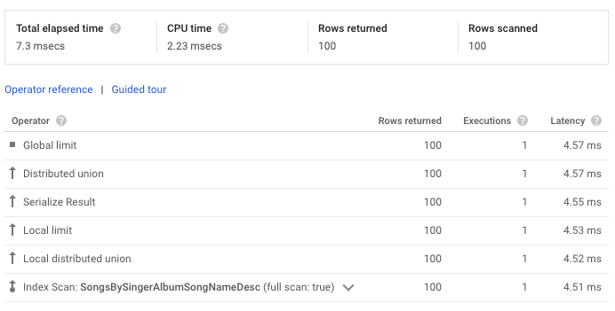

[Query execution operators](https://docs.cloud.google.com/spanner/docs/query-execution-operators) は複数ページに分割されており、以前より多くの operator がドキュメント化されている。一方で metadata やそれぞれの child links については未解説の部分も多いためここにまとめる。
なお、公式ドキュメントにない事柄や実行計画の細部は、間違っていたり今後予告なく変更される可能性がある。

この文書の再現 SQL と実行計画は、特定の schema、データ量、統計情報、optimizer version（オプティマイザーバージョン）、hint の組み合わせで観測した例である。Spanner はコストベース最適化を行うため、optimizer version、統計情報、データ分布が変わると同じ SQL でも違う実行計画になることがある。特に、テーブルを作成した直後など統計情報が存在しない状態では、実質的にルールベースに近い選択になっていたと考えられる例がある。

対象: 実行計画を可視化や解析のために処理するツール作成者や、含まれる情報全てをクエリの理解に役立てたいと考えるユーザ

TODO: Metadata や ChildLinks の表の形式化を進める。

## 実行計画の構造

実行計画の実体は [`google.spanner.v1.QueryPlan`](https://cloud.google.com/spanner/docs/reference/rpc/google.spanner.v1?hl=en#queryplan) であり、各クライアントや Web UI が表示するものは REST API や gRPC API の `ExecuteSql` もしくは `ExecuteStreamingSql` API 経由で `QueryMode` に `PLAN` もしくは `PROFILE` を指定することで取得した `QueryPlan` そのものである。

`QueryPlan` は [`PlanNode`](https://cloud.google.com/spanner/docs/reference/rpc/google.spanner.v1?hl=en#plannode) の集合であり、 `PlanNode` は operator と一対一で対応する。
各 `PlanNode` の動作は `display_name` によって特定できる operator の種類と、 operator の動作を変える `metadata` によって決まり、`child_links` に入力として使う子の operator が列挙されている。

実行計画に含まれる operator にはストリームを返す Relational operator の他にも Scalar operator があるが、 Scalar operator の方は親の Relational operator の一部として表示される。


例えば上記の Table Scan operator の実体は [Scan](#scan) operator であり、 `Table Scan: Songs` の部分及び `full scan: true` は metadata からの情報を合わせて表示している。また、デフォルトでは折りたたまれている変数名とスキャン対象の列名の対応関係は全て Scalar operator である。



```yaml
- childLinks:
  - childIndex: 4
    variable: SingerId
  - childIndex: 5
    variable: AlbumId
  - childIndex: 6
    variable: TrackId
  - childIndex: 7
    variable: SongName
  - childIndex: 8
    variable: Duration
  - childIndex: 9
    variable: SongGenre
  displayName: Scan
  index: 3
  kind: RELATIONAL
  metadata:
    Full scan: 'true'
    scan_target: Songs
    scan_type: TableScan
```



## Relational operators

`kind: RELATIONAL` なもので、行のストリームを返す operator である。

### Distributed operators

分散実行される operator 群であり、 `subquery_cluster_node` が指す方の子の Relational operator からなる実行計画のサブツリーを `Split Range` の条件を満たす remote server で実行することで、 server を跨ぐ replica から結果を得るという共通点がある。

* https://docs.cloud.google.com/spanner/docs/query-operators-distributed

#### Distributed Anti Semi Apply

`NOT EXISTS` などを処理するために分散 Anti Semi Join を行う。Distributed Cross Apply と似た構造を持つ。

* https://docs.cloud.google.com/spanner/docs/query-operators-distributed#distributed-anti-semi-apply

##### Metadata

| key | values | description |
|-----|--------|-------------|
| subquery_cluster_node | | 分散実行する対象の Relation operator の ID |

##### ChildLinks

|kind      | type | variable? | multiple? | description |
|----------|-----|--------|---|-------------|
|RELATIONAL|(Input) | |  | いわゆる駆動表に対応する入力側のサブツリーであり、実際には type を持たないが Web UI やドキュメント等で Input と表示される。通常 Create Batch を持つ。|
|RELATIONAL| Map |  |  | Input 側の値に応じて分散実行されるサブツリーであり、通常 Batch Scan と Cross Apply を含む。|
|SCALAR    | Split Range |  |  | 分散実行する対象の replica をキーから限定するための Function |
|SCALAR    | Batch | Yes | Yes | Input 側の Batch から生成する行の定義? |



以下の実行計画は Spanner Omni 2026.r1-beta で出力したもので、spannerplan v0.1.8 のデフォルト出力である。Spanner はコストベース最適化を行うため、optimizer version、統計情報、データ分布によって同じ SQL でも違う実行計画になることがあり、今後も同じ結果である保証はない。

```sql
@{JOIN_METHOD=APPLY_JOIN, BATCH_MODE=TRUE}
SELECT s.SingerId, s.FirstName
FROM Singers AS s
WHERE NOT EXISTS (
  SELECT 1
  FROM Albums AS a
  WHERE a.SingerId = s.SingerId
);
```

```text
=== subquery-join-hint-matrix/not_exists/apply_join_batch_true ===
@{JOIN_METHOD=APPLY_JOIN, BATCH_MODE=TRUE}
SELECT s.SingerId, s.FirstName
FROM Singers AS s
WHERE NOT EXISTS (SELECT 1 FROM Albums AS a WHERE a.SingerId = s.SingerId)
+-----+--------------------------------------------------------------------------------------------------+
| ID  | Operator                                                                                         |
+-----+--------------------------------------------------------------------------------------------------+
|   0 | Distributed Union on SingersByFirstLastName <Row>                                                |
|   1 | +- Serialize Result <Row>                                                                        |
|  *2 |    +- Distributed Anti Semi Apply <Row>                                                          |
|   3 |       +- [Input] Create Batch <Row>                                                              |
|   4 |       |  +- Local Distributed Union <Row>                                                        |
|   5 |       |     +- Compute Struct <Row>                                                              |
|   6 |       |        +- Index Scan on SingersByFirstLastName <Row> (Full scan, scan_method: Automatic) |
|  13 |       +- [Map] Semi Apply <Row>                                                                  |
|  14 |          +- [Input] KeyRangeAccumulator <Row>                                                    |
|  15 |          |  +- Batch Scan on $v2 <Row> (scan_method: Row)                                        |
|  19 |          +- [Map] Local Distributed Union <Row>                                                  |
|  20 |             +- Filter Scan <Row> (seekable_key_size: 0)                                          |
| *21 |                +- Table Scan on Albums <Row> (scan_method: Row)                                  |
+-----+--------------------------------------------------------------------------------------------------+
Predicates(identified by ID):
  2: Split Range: ($SingerId_1 = $SingerId)
 21: Seek Condition: ($SingerId_1 = $batched_SingerId)
```



#### Distributed Cross Apply

分散 Apply Join を行う。Input 側の Relational operator から取り出した値を使って、対応する Map 側の Relational operator を適切な replica で実行することで分散 JOIN を実現する。

* https://docs.cloud.google.com/spanner/docs/query-operators-distributed#distributed-cross-apply

##### Metadata

| key | values | description |
|-----|--------|-------------|
| subquery_cluster_node | | 分散実行する対象の Relation operator の ID |

##### ChildLinks

|kind      | type | variable? | multiple? | description |
|----------|-----|--------|---|-------------|
|RELATIONAL| (Input) | | | いわゆる駆動表に対応する入力側のサブツリーであり、実際には type を持たないが Web UI やドキュメント等で Input と表示される。通常 Create Batch を持つ。|
|RELATIONAL| Map |  | | Input 側の値に応じて分散実行されるサブツリーであり、通常 Batch Scan と Cross Apply を含む。|
|SCALAR    | Split Range |  | | 分散実行する対象の replica をキーから限定するための Function |



以下の実行計画は Spanner Omni 2026.r1-beta で出力したもので、spannerplan v0.1.8 のデフォルト出力である。Spanner はコストベース最適化を行うため、optimizer version、統計情報、データ分布によって同じ SQL でも違う実行計画になることがあり、今後も同じ結果である保証はない。

```sql
SELECT s.SongName, s.Duration
FROM Songs@{FORCE_INDEX=SongsBySongName} AS s
WHERE STARTS_WITH(s.SongName, "B");
```

```text
=== execution-plans/index-with-back-join ===
SELECT s.SongName, s.Duration FROM Songs@{FORCE_INDEX=SongsBySongName} AS s WHERE STARTS_WITH(s.SongName, "B")
+-----+--------------------------------------------------------------------------+
| ID  | Operator                                                                 |
+-----+--------------------------------------------------------------------------+
|  *0 | Distributed Union on SongsBySongName <Row>                               |
|  *1 | +- Distributed Cross Apply <Row>                                         |
|   2 |    +- [Input] Create Batch <Batch>                                       |
|   3 |    |  +- RowToDataBlock                                                  |
|   4 |    |     +- Local Distributed Union <Row>                                |
|   5 |    |        +- Filter Scan <Row> (seekable_key_size: 1)                  |
|  *6 |    |           +- Index Scan on SongsBySongName <Row> (scan_method: Row) |
|  19 |    +- [Map] Serialize Result <Row>                                       |
|  20 |       +- Cross Apply <Row>                                               |
|  21 |          +- [Input] KeyRangeAccumulator <Row>                            |
|  22 |          |  +- DataBlockToRow                                            |
|  23 |          |     +- Batch Scan on $v2 <Batch> (scan_method: Batch)         |
|  32 |          +- [Map] Local Distributed Union <Row>                          |
|  33 |             +- Filter Scan <Row> (seekable_key_size: 0)                  |
| *34 |                +- Table Scan on Songs <Row> (scan_method: Row)           |
+-----+--------------------------------------------------------------------------+
Predicates(identified by ID):
  0: Split Range: STARTS_WITH($SongName, 'B')
  1: Split Range: (($Songs_key_SingerId' = $Songs_key_SingerId) AND ($Songs_key_AlbumId' = $Songs_key_AlbumId) AND ($Songs_key_TrackId' = $Songs_key_TrackId))
  6: Seek Condition: STARTS_WITH($SongName, 'B')
 34: Seek Condition: (($Songs_key_SingerId' = $batched_Songs_key_SingerId') AND ($Songs_key_AlbumId' = $batched_Songs_key_AlbumId') AND ($Songs_key_TrackId' = $batched_Songs_key_TrackId'))
```



#### Distributed Outer Apply

`LEFT OUTER JOIN` などを処理するために分散 OUTER JOIN を行う。Distributed Cross Apply と似た構造を持つ。

* https://docs.cloud.google.com/spanner/docs/query-operators-distributed#distributed-outer-apply

##### Metadata

| key | values | description |
|-----|--------|-------------|
| subquery_cluster_node | | 分散実行する対象の Relation operator の ID |

##### ChildLinks

|kind      | type | variable? | multiple? | description |
|----------|-----|--------|---|-------------|
|RELATIONAL| (Input) | | | いわゆる駆動表に対応する入力側のサブツリーであり、実際には type を持たないが Web UI やドキュメント等で Input と表示される。通常 Create Batch を持つ。|
|RELATIONAL| Map |  | | Input 側の値に応じて分散実行されるサブツリーであり、通常 Batch Scan と Cross Apply を含む。|
|SCALAR    | Split Range |  | | 分散実行する対象の replica をキーから限定するための Function |
|SCALAR    | Batch | Yes | Yes | 結合条件を満たさなかった時に Input 側の Batch から生成する行の定義 |



以下の実行計画は Spanner Omni 2026.r1-beta で出力したもので、spannerplan v0.1.8 のデフォルト出力である。Spanner はコストベース最適化を行うため、optimizer version、統計情報、データ分布によって同じ SQL でも違う実行計画になることがあり、今後も同じ結果である保証はない。

```sql
SELECT a.AlbumTitle, s.SongName
FROM Albums AS a
LEFT JOIN@{JOIN_METHOD=APPLY_JOIN, BATCH_MODE=TRUE} Songs AS s
ON a.SingerId = s.SingerId AND a.AlbumId = s.AlbumId;
```

```text
=== join-matrix/left/apply_join_batch_true ===
SELECT a.AlbumTitle, s.SongName
FROM Albums AS a LEFT JOIN@{JOIN_METHOD=APPLY_JOIN, BATCH_MODE=TRUE} Songs AS s
ON a.SingerId = s.SingerId AND a.AlbumId = s.AlbumId
+-----+----------------------------------------------------------------------------------------------+
| ID  | Operator                                                                                     |
+-----+----------------------------------------------------------------------------------------------+
|   0 | Distributed Union on AlbumsByAlbumTitle <Row>                                                |
|   1 | +- Serialize Result <Row>                                                                    |
|  *2 |    +- Distributed Outer Apply <Row>                                                          |
|   3 |       +- [Input] Create Batch <Row>                                                          |
|   4 |       |  +- Local Distributed Union <Row>                                                    |
|   5 |       |     +- Compute Struct <Row>                                                          |
|   6 |       |        +- Index Scan on AlbumsByAlbumTitle <Row> (Full scan, scan_method: Automatic) |
|  15 |       +- [Map] Cross Apply <Row>                                                             |
|  16 |          +- [Input] KeyRangeAccumulator <Row>                                                |
|  17 |          |  +- Batch Scan on $v2 <Row> (scan_method: Row)                                    |
|  22 |          +- [Map] Local Distributed Union <Row>                                              |
|  23 |             +- Filter Scan <Row> (seekable_key_size: 0)                                      |
| *24 |                +- Index Scan on SongsBySingerAlbumSongNameDesc <Row> (scan_method: Row)      |
+-----+----------------------------------------------------------------------------------------------+
Predicates(identified by ID):
  2: Split Range: (($SingerId_1 = $SingerId) AND ($AlbumId_1 = $AlbumId))
 24: Seek Condition: (($SingerId_1 = $batched_SingerId) AND ($AlbumId_1 = $batched_AlbumId))
```



#### Distributed Semi Apply

`EXISTS` などを処理するために分散 Semi Join を行う。Distributed Cross Apply と似た構造を持つ。

* https://docs.cloud.google.com/spanner/docs/query-operators-distributed#distributed-semi-apply

##### Metadata

| key | values | description |
|-----|--------|-------------|
| subquery_cluster_node | | 分散実行する対象の Relation operator の ID |

##### ChildLinks

|kind      | type | variable? | multiple? | description |
|----------|-----|--------|---|-------------|
|RELATIONAL| (Input) | | | いわゆる駆動表に対応する入力側のサブツリーであり、実際には type を持たないが Web UI やドキュメント等で Input と表示される。通常 Create Batch を持つ。|
|RELATIONAL| Map |  | | Input 側の値に応じて分散実行されるサブツリーであり、通常 Batch Scan と Cross Apply を含む。|
|SCALAR    | Split Range |  | | 分散実行する対象の replica をキーから限定するための Function |
|SCALAR    | Batch | Yes | Yes | Input 側の Batch から生成する行の定義? |



以下の実行計画は Spanner Omni 2026.r1-beta で出力したもので、spannerplan v0.1.8 のデフォルト出力である。Spanner はコストベース最適化を行うため、optimizer version、統計情報、データ分布によって同じ SQL でも違う実行計画になることがあり、今後も同じ結果である保証はない。

```sql
@{JOIN_METHOD=APPLY_JOIN, BATCH_MODE=TRUE}
SELECT s.SingerId, s.FirstName
FROM Singers AS s
WHERE s.SingerId IN (
  SELECT a.SingerId
  FROM Albums AS a
);
```

```text
=== subquery-join-hint-matrix/in/apply_join_batch_true ===
@{JOIN_METHOD=APPLY_JOIN, BATCH_MODE=TRUE}
SELECT s.SingerId, s.FirstName
FROM Singers AS s
WHERE s.SingerId IN (SELECT a.SingerId FROM Albums AS a)
+-----+--------------------------------------------------------------------------------------------------+
| ID  | Operator                                                                                         |
+-----+--------------------------------------------------------------------------------------------------+
|   0 | Distributed Union on SingersByFirstLastName <Row>                                                |
|   1 | +- Serialize Result <Row>                                                                        |
|  *2 |    +- Distributed Semi Apply <Row>                                                               |
|   3 |       +- [Input] Create Batch <Row>                                                              |
|   4 |       |  +- Local Distributed Union <Row>                                                        |
|   5 |       |     +- Compute Struct <Row>                                                              |
|   6 |       |        +- Index Scan on SingersByFirstLastName <Row> (Full scan, scan_method: Automatic) |
|  13 |       +- [Map] Semi Apply <Row>                                                                  |
|  14 |          +- [Input] KeyRangeAccumulator <Row>                                                    |
|  15 |          |  +- Batch Scan on $v2 <Row> (scan_method: Row)                                        |
|  19 |          +- [Map] Local Distributed Union <Row>                                                  |
|  20 |             +- Filter Scan <Row> (seekable_key_size: 0)                                          |
| *21 |                +- Table Scan on Albums <Row> (scan_method: Row)                                  |
+-----+--------------------------------------------------------------------------------------------------+
Predicates(identified by ID):
  2: Split Range: ($SingerId_1 = $SingerId)
 21: Seek Condition: ($SingerId_1 = $batched_SingerId)
```



#### Push Broadcast Hash Join

`JOIN_METHOD=PUSH_BROADCAST_HASH_JOIN` で現れる分散 hash join 系の operator。
通常 join では `Push Broadcast Hash Join`、outer join では `Push Broadcast Hash Join Outer Apply`、subquery predicate では `Push Broadcast Hash Join Semi Apply` や `Push Broadcast Hash Join Anti Semi Apply` として表示される。
内部に通常の `Hash Join`、`Create Batch`、`RowToDataBlock`、`DataBlockToRow` などが現れるため、descendant に `Hash Join` があることだけで通常の Hash Join と解釈しない方がよい。

* https://docs.cloud.google.com/spanner/docs/query-operators-distributed#push-broadcast-hash-join

##### ChildLinks

|kind      | type | variable? | multiple? | description |
|----------|-----|--------|---|-------------|
|RELATIONAL| (Input) | | | broadcast する入力側のサブツリー。通常 Create Batch を含む。|
|RELATIONAL| Map | | | broadcast された batch と probe 側を使って実行されるサブツリー。通常 Hash Join を含む。|
|SCALAR    | Split Range | | | 分散実行する対象の replica をキーから限定するための Function |



以下の実行計画は Spanner Omni 2026.r1-beta で出力したもので、spannerplan v0.1.8 のデフォルト出力である。Spanner はコストベース最適化を行うため、optimizer version、統計情報、データ分布によって同じ SQL でも違う実行計画になることがあり、今後も同じ結果である保証はない。

Push Broadcast Hash Join:

```sql
SELECT a.AlbumTitle, s.SongName
FROM Albums AS a
JOIN@{JOIN_METHOD=PUSH_BROADCAST_HASH_JOIN} Songs AS s
ON a.SingerId = s.SingerId AND a.AlbumId = s.AlbumId;
```

```text
+-----+-------------------------------------------------------------------------------------------------------+
| ID  | Operator                                                                                              |
+-----+-------------------------------------------------------------------------------------------------------+
|   0 | Distributed Union on AlbumsByAlbumTitle <Row>                                                         |
|  *1 | +- Push Broadcast Hash Join <Row>                                                                     |
|   2 |    +- Create Batch <Batch>                                                                            |
|   3 |    |  +- RowToDataBlock                                                                               |
|   4 |    |     +- Local Distributed Union <Row>                                                             |
|   5 |    |        +- Index Scan on AlbumsByAlbumTitle <Row> (Full scan, scan_method: Automatic)             |
|  12 |    +- [Map] Serialize Result <Row>                                                                    |
| *13 |       +- Hash Join <Row> (join_type: INNER)                                                           |
|  14 |          +- [Build] DataBlockToRow                                                                    |
|  15 |          |  +- Batch Scan on $v2 <Batch> (scan_method: Batch)                                         |
|  22 |          +- [Probe] Local Distributed Union <Row>                                                     |
|  23 |             +- Index Scan on SongsBySingerAlbumSongNameDesc <Row> (Full scan, scan_method: Automatic) |
+-----+-------------------------------------------------------------------------------------------------------+
Predicates(identified by ID):
  1: Split Range: (($SingerId_1 = $SingerId) AND ($AlbumId_1 = $AlbumId))
 13: Condition: (($batched_SingerId' = $SingerId_1) AND ($batched_AlbumId' = $AlbumId_1))
```

Outer Apply:

```sql
SELECT a.AlbumTitle, s.SongName
FROM Albums AS a
LEFT JOIN@{JOIN_METHOD=PUSH_BROADCAST_HASH_JOIN} Songs AS s
ON a.SingerId = s.SingerId AND a.AlbumId = s.AlbumId;
```

```text
+-----+-------------------------------------------------------------------------------------------------------+
| ID  | Operator                                                                                              |
+-----+-------------------------------------------------------------------------------------------------------+
|   0 | Distributed Union on AlbumsByAlbumTitle <Row>                                                         |
|   1 | +- Serialize Result <Row>                                                                             |
|  *2 |    +- Push Broadcast Hash Join Outer Apply <Row>                                                      |
|   3 |       +- [Input] Create Batch <Row>                                                                   |
|   4 |       |  +- Local Distributed Union <Row>                                                             |
|   5 |       |     +- Compute Struct <Row>                                                                   |
|   6 |       |        +- Index Scan on AlbumsByAlbumTitle <Row> (Full scan, scan_method: Automatic)          |
| *15 |       +- [Map] Hash Join <Row> (join_type: INNER)                                                     |
|  16 |          +- [Build] Batch Scan on $v2 <Row> (scan_method: Row)                                        |
|  21 |          +- [Probe] Local Distributed Union <Row>                                                     |
|  22 |             +- Index Scan on SongsBySingerAlbumSongNameDesc <Row> (Full scan, scan_method: Automatic) |
+-----+-------------------------------------------------------------------------------------------------------+
Predicates(identified by ID):
  2: Split Range: (($SingerId_1 = $SingerId) AND ($AlbumId_1 = $AlbumId))
 15: Condition: (($batched_SingerId = $SingerId_1) AND ($batched_AlbumId = $AlbumId_1))
```

Semi Apply:

```sql
@{JOIN_METHOD=PUSH_BROADCAST_HASH_JOIN}
SELECT s.SingerId, s.FirstName
FROM Singers AS s
WHERE s.SingerId IN (SELECT a.SingerId FROM Albums AS a);
```

```text
+-----+--------------------------------------------------------------------------------------------------+
| ID  | Operator                                                                                         |
+-----+--------------------------------------------------------------------------------------------------+
|   0 | Distributed Union on SingersByFirstLastName <Row>                                                |
|   1 | +- Serialize Result <Row>                                                                        |
|  *2 |    +- Push Broadcast Hash Join Semi Apply <Row>                                                  |
|   3 |       +- [Input] Create Batch <Row>                                                              |
|   4 |       |  +- Local Distributed Union <Row>                                                        |
|   5 |       |     +- Compute Struct <Row>                                                              |
|   6 |       |        +- Index Scan on SingersByFirstLastName <Row> (Full scan, scan_method: Automatic) |
| *13 |       +- [Map] Hash Join <Row> (join_type: INNER)                                                |
|  14 |          +- [Build] Batch Scan on $v2 <Row> (scan_method: Row)                                   |
|  18 |          +- [Probe] Local Distributed Union <Row>                                                |
|  19 |             +- Table Scan on Albums <Row> (Full scan, scan_method: Automatic)                    |
+-----+--------------------------------------------------------------------------------------------------+
Predicates(identified by ID):
  2: Split Range: ($SingerId_1 = $SingerId)
 13: Condition: ($batched_SingerId = $SingerId_1)
```

Anti Semi Apply:

```sql
@{JOIN_METHOD=PUSH_BROADCAST_HASH_JOIN}
SELECT s.SingerId, s.FirstName
FROM Singers AS s
WHERE NOT EXISTS (SELECT 1 FROM Albums AS a WHERE a.SingerId = s.SingerId);
```

```text
+-----+--------------------------------------------------------------------------------------------------+
| ID  | Operator                                                                                         |
+-----+--------------------------------------------------------------------------------------------------+
|   0 | Distributed Union on SingersByFirstLastName <Row>                                                |
|   1 | +- Serialize Result <Row>                                                                        |
|  *2 |    +- Push Broadcast Hash Join Anti Semi Apply <Row>                                             |
|   3 |       +- [Input] Create Batch <Row>                                                              |
|   4 |       |  +- Local Distributed Union <Row>                                                        |
|   5 |       |     +- Compute Struct <Row>                                                              |
|   6 |       |        +- Index Scan on SingersByFirstLastName <Row> (Full scan, scan_method: Automatic) |
| *13 |       +- [Map] Hash Join <Row> (join_type: INNER)                                                |
|  14 |          +- [Build] Batch Scan on $v2 <Row> (scan_method: Row)                                   |
|  18 |          +- [Probe] Local Distributed Union <Row>                                                |
|  19 |             +- Table Scan on Albums <Row> (Full scan, scan_method: Automatic)                    |
+-----+--------------------------------------------------------------------------------------------------+
Predicates(identified by ID):
  2: Split Range: ($SingerId_1 = $SingerId)
 13: Condition: ($SingerId_1 = $batched_SingerId)
```



#### Distributed Union

各 replica で子の Relation operator を実行し、結果をまとめる。
クエリ対象の replica を他の server(remote server) が持つ場合、remote server を呼び出すため remote call が発生し、 `executionStats` に記録される。
`call_type` が Local なものは、特定の server 内の結果をまとめる。

* https://docs.cloud.google.com/spanner/docs/query-operators-distributed#distributed-union

##### Metadata
| key | values | description |
|-----|--------|-------------|
| call_type | Local, 未指定 ||
| subquery_cluster_node | | 分散実行する対象の Relation operator の ID |

##### ChildLinks

|kind      | type | variable? | multiple? | description |
|----------|-----|--------|---|-------------|
|RELATIONAL|  | | | 入力として分散実行されるサブツリー |
|SCALAR    | Split Range |  | | 分散実行する対象の replica をキーから限定するための Function |



以下の実行計画は Spanner Omni 2026.r1-beta で出力したもので、spannerplan v0.1.8 のデフォルト出力である。Spanner はコストベース最適化を行うため、optimizer version、統計情報、データ分布によって同じ SQL でも違う実行計画になることがあり、今後も同じ結果である保証はない。

```sql
SELECT s.SongName
FROM Songs AS s;
```

```text
=== execution-plans/simple-scan ===
SELECT s.SongName FROM Songs AS s
+----+-------------------------------------------------------------------------------------------------+
| ID | Operator                                                                                        |
+----+-------------------------------------------------------------------------------------------------+
|  0 | Distributed Union on SongsBySingerAlbumSongNameDesc <Row>                                       |
|  1 | +- Local Distributed Union <Row>                                                                |
|  2 |    +- Serialize Result <Row>                                                                    |
|  3 |       +- Index Scan on SongsBySingerAlbumSongNameDesc <Row> (Full scan, scan_method: Automatic) |
+----+-------------------------------------------------------------------------------------------------+
```



#### Distributed Merge Union

複数の remote server に分散した subquery の結果を、指定された順序で merge して返す operator。
公式ドキュメントでは distributed merge sort として説明されており、Spanner Version 3 以降ではデフォルトで有効とされている。

* https://docs.cloud.google.com/spanner/docs/query-operators-distributed#distributed-merge-union

### Leaf operators

公式ドキュメントで Leaf operators に分類されている operator 群。

#### Array Unnest

配列の値と添字を元に Relation を作り出す operator。

* https://docs.cloud.google.com/spanner/docs/query-operators-leaf#array-unnest

##### ChildLinks

|kind      | type | variable? | multiple? | description |
|----------|-----|--------|---|-------------|
|SCALAR    | | Yes | | 配列の値に対応する変数名を指示する |
|SCALAR    | | Yes | | 配列の添字に対応する変数名を指示する |



以下の実行計画は Spanner Omni 2026.r1-beta で出力したもので、spannerplan v0.1.8 のデフォルト出力である。Spanner はコストベース最適化を行うため、optimizer version、統計情報、データ分布によって同じ SQL でも違う実行計画になることがあり、今後も同じ結果である保証はない。

```sql
SELECT a, b
FROM UNNEST([1, 2, 3]) a WITH OFFSET b;
```

```text
=== leaf/array-unnest ===
SELECT a, b FROM UNNEST([1,2,3]) a WITH OFFSET b
+----+------------------------+
| ID | Operator               |
+----+------------------------+
|  0 | Serialize Result <Row> |
|  1 | +- Array Unnest <Row>  |
+----+------------------------+
```



#### Empty Relation

空の Relation を生成する。`LIMIT 0` を指定した際には常に結果は 0 行で何も Scan 等の入力をする必要がないが、 Relation operator ではある必要があるので使われる。

* https://docs.cloud.google.com/spanner/docs/query-operators-leaf#empty-relation

##### ChildLinks

|kind      | type | variable? | multiple? | description |
|----------|-----|--------|---|-------------|
|SCALAR    |  | | | 0 を意味する Constant |



以下の実行計画は Spanner Omni 2026.r1-beta で出力したもので、spannerplan v0.1.8 のデフォルト出力である。Spanner はコストベース最適化を行うため、optimizer version、統計情報、データ分布によって同じ SQL でも違う実行計画になることがあり、今後も同じ結果である保証はない。

```sql
SELECT *
FROM Albums
LIMIT 0;
```

```text
=== leaf/empty-relation ===
SELECT * FROM Albums LIMIT 0
+----+-------------------------+
| ID | Operator                |
+----+-------------------------+
|  0 | Serialize Result <Row>  |
|  1 | +- Empty Relation <Row> |
+----+-------------------------+
```



#### Generate Relation

0 行以上の relation を生成する operator。
現時点のフィードバックでは、Spanner Omni 2026.r1-beta でこの operator 名を単独で安定して表示する最小再現クエリは確認できていない。
`SELECT 1 + 2` のような定数式だけのクエリは、現在の実行計画では `Generate Relation` ではなく `Unit Relation` として表示される。

* https://docs.cloud.google.com/spanner/docs/query-operators-leaf#generate-relation

#### Scan

各入力からのスキャンを行う。`PlanNode.displayName` としては Scan だが、一般的に `scan_type` の値と合わせて Index Scan, Table Scan などと表示される。

* https://docs.cloud.google.com/spanner/docs/query-operators-leaf#scan

##### Metadata

| key | values | description |
|-----|--------|-------------|
| Full scan | true もしくは未指定 ||
| scan_target | | スキャン対象の名前を指示する。 |
| scan_type | IndexScan, TableScan, SpoolScan, BatchScan | スキャン対象の種類を指示する。 |

##### ChildLinks

|kind      | type | variable? | multiple? | description |
|----------|-----|--------|---|-------------|
|SCALAR    |  | Yes | Yes | スキャン対象の列を表現する |



以下の実行計画は Spanner Omni 2026.r1-beta で出力したもので、spannerplan v0.1.8 のデフォルト出力である。Spanner はコストベース最適化を行うため、optimizer version、統計情報、データ分布によって同じ SQL でも違う実行計画になることがあり、今後も同じ結果である保証はない。

```sql
SELECT s.SongName
FROM Songs AS s;
```

```text
=== execution-plans/simple-scan ===
SELECT s.SongName FROM Songs AS s
+----+-------------------------------------------------------------------------------------------------+
| ID | Operator                                                                                        |
+----+-------------------------------------------------------------------------------------------------+
|  0 | Distributed Union on SongsBySingerAlbumSongNameDesc <Row>                                       |
|  1 | +- Local Distributed Union <Row>                                                                |
|  2 |    +- Serialize Result <Row>                                                                    |
|  3 |       +- Index Scan on SongsBySingerAlbumSongNameDesc <Row> (Full scan, scan_method: Automatic) |
+----+-------------------------------------------------------------------------------------------------+
```



#### Filter Scan

Scan のすぐ上に位置し、スキャンに伴って処理できるフィルタを行う。現在の QueryPlan では `display_name` / `displayName` 自体が `Filter Scan` とスペース入りで返る。
以前の実行計画や古い説明では `FilterScan` と表記されることがあったが、現行の operator name としては `Filter Scan` を使う。
Scan の一部として働くため `executionStats` を持たず、実行時の挙動は Scan 側の `rows`, `filtered_rows` などを通して確認できる。

* https://docs.cloud.google.com/spanner/docs/query-operators-leaf#filter_scan

##### ChildLinks
|kind      | type | variable? | multiple? | description |
|----------|-----|--------|---|-------------|
|RELATIONAL|  | | | フィルタの入力となる Scan |
|SCALAR    | Seek Condition |  | | スキャン対象のキー範囲を絞るシークに使う Function であり、 [アクセス述語](https://use-the-index-luke.com/ja/sql/where-clause/searching-for-ranges/greater-less-between-tuning-sql-access-filter-predicates)に対応する。|
|SCALAR    | Residual Condition |  | | スキャン後のフィルタに使う Function であり、[フィルタ述語](https://use-the-index-luke.com/ja/sql/where-clause/searching-for-ranges/greater-less-between-tuning-sql-access-filter-predicates)に対応する。 |



以下の実行計画は Spanner Omni 2026.r1-beta で出力したもので、spannerplan v0.1.8 のデフォルト出力である。Spanner はコストベース最適化を行うため、optimizer version、統計情報、データ分布によって同じ SQL でも違う実行計画になることがあり、今後も同じ結果である保証はない。

```sql
SELECT LastName
FROM Singers
WHERE SingerId = 1;
```

```text
+----+------------------------------------------------------------+
| ID | Operator                                                   |
+----+------------------------------------------------------------+
| *0 | Distributed Union on Singers <Row>                         |
|  1 | +- Local Distributed Union <Row>                           |
|  2 |    +- Serialize Result <Row>                               |
|  3 |       +- Filter Scan <Row> (seekable_key_size: 0)          |
| *4 |          +- Table Scan on Singers <Row> (scan_method: Row) |
+----+------------------------------------------------------------+
Predicates(identified by ID):
 0: Split Range: ($SingerId = 1)
 4: Seek Condition: ($SingerId = 1)
```



#### Recursive Spool Scan

Graph query の recursive path などで、`Recursive Union` の再帰ステップから前回までの中間結果を参照するために現れる。
通常の `SpoolScan` は `Scan` operator の `scan_type` として表現されるが、recursive plan では `Recursive Spool Scan` という表示名の leaf operator として観測される。
公式ドキュメントでは独立した operator 節はないが、Recursive Union の説明内で recursive spool scan として言及されている。

* https://docs.cloud.google.com/spanner/docs/query-operators-binary#recursive-union

##### ChildLinks

確認できている範囲では Relational operator の子を持たない。



以下は該当 operator を観測できる再現 SQL の例である。Spanner はコストベース最適化を行うため、実行計画の形は Spanner のバージョン、optimizer version、統計情報、hint の解釈で変わり、同じ結果である保証はない。対応する実行計画は [Recursive Union](#recursive-union) の details に含めている。

```sql
GRAPH MusicGraph
MATCH (singer:Singers {singerId:42})-[c:CollabWith]->{1,2}(featured:Singers)
RETURN singer.SingerId AS singer, featured.SingerId AS featured;
```



#### Unit Relation

特に値を持たない単一の行を生成する。 Unit Relation を受ける Compute や Serialize Result で実際の列の値が設定される。
例: `SELECT 42`, `SELECT 42 UNION ALL SELECT 43`

* https://docs.cloud.google.com/spanner/docs/query-operators-leaf#unit-relation

##### Child Links

|kind      | type | variable? | multiple? | description |
|----------|-----|--------|---|-------------|
|SCALAR    | | | Yes | `1` を表現する Constant が常に指定される。|



以下の実行計画は Spanner Omni 2026.r1-beta で出力したもので、spannerplan v0.1.8 のデフォルト出力である。Spanner はコストベース最適化を行うため、optimizer version、統計情報、データ分布によって同じ SQL でも違う実行計画になることがあり、今後も同じ結果である保証はない。

```sql
SELECT 1 + 2 AS Result;
```

```text
=== leaf/unit-relation-constant-function ===
SELECT 1 + 2 AS Result
+----+------------------------+
| ID | Operator               |
+----+------------------------+
|  0 | Serialize Result <Row> |
|  1 | +- Unit Relation <Row> |
+----+------------------------+
```



### Unary operators

Relational operator の子を1つだけ持つ Relational operator 群。

#### Aggregate

`GROUP BY` に対応する集約を行う。
入力がインデックス等で既にソート済であり、その順序で集約することでハッシュテーブルを使わなくて良い時は `iterator_type` が Stream となり Stream Aggregate と呼ばれる。
`GROUP@{GROUP_METHOD=HASH_GROUP}` と `GROUP@{GROUP_METHOD=STREAM_GROUP}` で同じ Aggregate operator の `iterator_type` が Hash / Stream に切り替わるため、実行計画の検査では `Aggregate` という operator 名だけでなく metadata も確認する必要がある。

* https://docs.cloud.google.com/spanner/docs/query-operators-unary#aggregate

##### Metadata

| key | values | description |
|-----|--------|-------------|
| call_type | Local もしくは Global | |
| iterator_type| Hash, Stream, もしくは未指定 | Stream か Hash による処理方法の区別を示す。|
| scalar_aggregate| true か未指定 | |

##### ChildLinks

|kind      | type | variable? | multiple? | description |
|----------|-----|--------|---|-------------|
|RELATIONAL|  |  | | 入力 |
|SCALAR    | Key | Yes | Yes | `scalar_aggregate=true` の時には存在しない。集約に使うキーを示す。|
|SCALAR    | Agg| Yes | Yes |Aggregate 対象の値を示す。|



以下の実行計画は Spanner Omni 2026.r1-beta で出力したもので、spannerplan v0.1.8 のデフォルト出力である。Spanner はコストベース最適化を行うため、optimizer version、統計情報、データ分布によって同じ SQL でも違う実行計画になることがあり、今後も同じ結果である保証はない。

Hash Aggregate:

```sql
SELECT s.SingerId, COUNT(*) AS SongCount
FROM Songs AS s
GROUP@{GROUP_METHOD=HASH_GROUP} BY s.SingerId;
```

```text
+----+----------------------------------------------------------------------------------------------------+
| ID | Operator                                                                                           |
+----+----------------------------------------------------------------------------------------------------+
|  0 | Distributed Union on Singers <Row> (split_ranges_aligned)                                          |
|  1 | +- Serialize Result <Row>                                                                          |
|  2 |    +- Hash Aggregate <Row>                                                                         |
|  3 |       +- Local Distributed Union <Row>                                                             |
|  4 |          +- Index Scan on SongsBySingerAlbumSongNameDesc <Row> (Full scan, scan_method: Automatic) |
+----+----------------------------------------------------------------------------------------------------+
```

Stream Aggregate:

```sql
SELECT s.SingerId, COUNT(*) AS SongCount
FROM Songs AS s
GROUP@{GROUP_METHOD=STREAM_GROUP} BY s.SingerId;
```

```text
+----+----------------------------------------------------------------------------------------------------+
| ID | Operator                                                                                           |
+----+----------------------------------------------------------------------------------------------------+
|  0 | Distributed Union on Singers <Row> (split_ranges_aligned)                                          |
|  1 | +- Serialize Result <Row>                                                                          |
|  2 |    +- Stream Aggregate <Row>                                                                       |
|  3 |       +- Local Distributed Union <Row>                                                             |
|  4 |          +- Index Scan on SongsBySingerAlbumSongNameDesc <Row> (Full scan, scan_method: Automatic) |
+----+----------------------------------------------------------------------------------------------------+
```



#### Apply Mutations

DML である `INSERT`, `UPDATE`, `DELETE` を処理する。サブツリーから row として取得した主キーと更新後の値を適用すると考えられるが、どの列をどのような式で更新するかのような定義は実行計画上は見えない。

* https://docs.cloud.google.com/spanner/docs/query-operators-unary#apply-mutations

##### Metadata

| key | values | description |
|-----|--------|-------------|
| operation_type | INSERT, UPDATE, DELETE | |
| table | | 更新対象のテーブル |

##### ChildLinks

|kind      | type | variable | multiple? | description |
|----------|-----|--------|---|-------------|
|RELATIONAL|  |  | | 入力 |



以下の実行計画は Spanner Omni 2026.r1-beta で出力したもので、spannerplan v0.1.8 のデフォルト出力である。Spanner はコストベース最適化を行うため、optimizer version、統計情報、データ分布によって同じ SQL でも違う実行計画になることがあり、今後も同じ結果である保証はない。

```sql
UPDATE Singers
SET LastName = "Smith"
WHERE SingerId = 1;
```

```text
+----+---------------------------------------------------------------+
| ID | Operator                                                      |
+----+---------------------------------------------------------------+
|  0 | Apply Mutations on Singers <Row> (operation_type: UPDATE)     |
|  1 | +- Serialize Result <Row>                                     |
| *2 |    +- Distributed Union on Singers <Row>                      |
|  3 |       +- Local Distributed Union <Row>                        |
|  4 |          +- Filter Scan <Row> (seekable_key_size: 0)          |
| *5 |             +- Table Scan on Singers <Row> (scan_method: Row) |
+----+---------------------------------------------------------------+
Predicates(identified by ID):
 2: Split Range: ($SingerId = 1)
 5: Seek Condition: ($SingerId = 1)
```



#### BloomFilterBuild

(Undocumented)
Bloom Filter を構築する。通常 Hash Join の Build 側に現れる。後に `BLOOM_FILTER_MATCH` を Condition に持つ Filter で使われる。

##### ChildLinks

|kind      | type | variable? | multiple? | description |
|----------|-----|--------|---|-------------|
|RELATIONAL| | | |入力 |



以下の実行計画は Spanner Omni 2026.r1-beta で出力したもので、spannerplan v0.1.8 のデフォルト出力である。Spanner はコストベース最適化を行うため、optimizer version、統計情報、データ分布によって同じ SQL でも違う実行計画になることがあり、今後も同じ結果である保証はない。

```sql
SELECT AlbumTitle
FROM Songs
JOIN Albums ON Albums.AlbumId = Songs.AlbumId;
```

```text
=== distributed/distributed-apply ===
SELECT AlbumTitle FROM Songs JOIN Albums ON Albums.AlbumId = Songs.AlbumId
+-----+-------------------------------------------------------------------------------------------------------+
| ID  | Operator                                                                                              |
+-----+-------------------------------------------------------------------------------------------------------+
|   0 | Serialize Result <Row>                                                                                |
|  *1 | +- Hash Join <Row> (join_type: INNER)                                                                 |
|   2 |    +- [Build] BloomFilterBuild <Row>                                                                  |
|   3 |    |  +- Distributed Union on SongsBySingerAlbumSongNameDesc <Row>                                    |
|   4 |    |     +- Local Distributed Union <Row>                                                             |
|   5 |    |        +- Index Scan on SongsBySingerAlbumSongNameDesc <Row> (Full scan, scan_method: Automatic) |
|   9 |    +- [Probe] Distributed Union on AlbumsByAlbumTitle <Row>                                           |
|  10 |       +- Local Distributed Union <Row>                                                                |
| *11 |          +- Filter Scan <Row> (seekable_key_size: 0)                                                  |
|  12 |             +- Index Scan on AlbumsByAlbumTitle <Row> (Full scan, scan_method: Automatic)             |
+-----+-------------------------------------------------------------------------------------------------------+
Predicates(identified by ID):
  1: Condition: ($AlbumId_1 = $AlbumId)
 11: Residual Condition: BLOOM_FILTER_MATCH($existence_filter, $AlbumId_1)
```



#### Compute

入力のそれぞれの行に対して新しい列を追加する。

* https://docs.cloud.google.com/spanner/docs/query-operators-unary#compute

##### ChildLinks

|kind      | type | variable? | multiple? | description |
|----------|-----|--------|---|-------------|
|RELATIONAL| | | | 入力 |
|SCALAR    | | Yes | Yes | 新しく計算する値を示す |



以下の実行計画は Spanner Omni 2026.r1-beta で出力したもので、spannerplan v0.1.8 のデフォルト出力である。Spanner はコストベース最適化を行うため、optimizer version、統計情報、データ分布によって同じ SQL でも違う実行計画になることがあり、今後も同じ結果である保証はない。

```sql
SELECT 1 AS a, 2 AS b
UNION ALL SELECT 3 AS a, 4 AS b
UNION ALL SELECT 5 AS a, 6 AS b;
```

```text
=== n-ary/union-all ===
SELECT 1 a, 2 b UNION ALL SELECT 3 a, 4 b UNION ALL SELECT 5 a, 6 b
+----+---------------------------------+
| ID | Operator                        |
+----+---------------------------------+
|  0 | Serialize Result <Row>          |
|  1 | +- Union All <Row>              |
|  2 |    +- Union Input               |
|  3 |    |  +- Compute <Row>          |
|  4 |    |     +- Unit Relation <Row> |
| 10 |    +- Union Input               |
| 11 |    |  +- Compute <Row>          |
| 12 |    |     +- Unit Relation <Row> |
| 18 |    +- Union Input               |
| 19 |       +- Compute <Row>          |
| 20 |          +- Unit Relation <Row> |
+----+---------------------------------+
```



#### Compute Struct

入力のそれぞれの行に対して STRUCT を生成する。 Compute Batch の入力や `AS STRUCT` を使ったサブクエリなどで現れる。

* https://docs.cloud.google.com/spanner/docs/query-operators-unary#compute_struct

##### ChildLinks

|kind      | type | variable? | multiple? | description |
|----------|-----|--------|---|-------------|
|RELATIONAL| | | | 入力 |
|SCALAR    | | Yes | Yes | STRUCT の各フィールドを表す |
|SCALAR    | Scalar | | Yes | 式で参照される Scalar Subquery(or Array Subquery) を指す。 |



以下の実行計画は Spanner Omni 2026.r1-beta で出力したもので、spannerplan v0.1.8 のデフォルト出力である。Spanner はコストベース最適化を行うため、optimizer version、統計情報、データ分布によって同じ SQL でも違う実行計画になることがあり、今後も同じ結果である保証はない。

```sql
SELECT FirstName,
       ARRAY(
         SELECT AS STRUCT song.SongName, song.SongGenre
         FROM Songs AS song
         WHERE song.SingerId = singer.SingerId
       )
FROM Singers AS singer
WHERE singer.SingerId = 1;
```

```text
=== unary/compute-struct ===
SELECT FirstName, ARRAY(SELECT AS STRUCT song.SongName, song.SongGenre FROM Songs AS song WHERE song.SingerId = singer.SingerId) FROM Singers AS singer WHERE singer.SingerId = 1
+-----+-------------------------------------------------------------------+
| ID  | Operator                                                          |
+-----+-------------------------------------------------------------------+
|  *0 | Distributed Union on Singers <Row> (split_ranges_aligned)         |
|   1 | +- Local Distributed Union <Row>                                  |
|   2 |    +- Serialize Result <Row>                                      |
|   3 |       +- Filter Scan <Row> (seekable_key_size: 0)                 |
|  *4 |       |  +- Table Scan on Singers <Row> (scan_method: Row)        |
|  12 |       +- [Scalar] Array Subquery                                  |
|  13 |          +- Local Distributed Union <Row>                         |
|  14 |             +- Compute Struct <Row>                               |
|  15 |                +- Filter Scan <Row> (seekable_key_size: 0)        |
| *16 |                   +- Table Scan on Songs <Row> (scan_method: Row) |
+-----+-------------------------------------------------------------------+
Predicates(identified by ID):
  0: Split Range: ($SingerId = 1)
  4: Seek Condition: ($SingerId = 1)
 16: Seek Condition: ($SingerId_1 = 1)
```



#### Create Batch

入力から batch を作成する。主に Distributed Cross Apply で入力をまとめて対応する replica に送り、 Batch Scan で参照するために使われる。
具体例は `Distributed Cross Apply`、`Push Broadcast Hash Join`、`Recursive Union` の再現クエリと実行計画で確認できる。

* https://docs.cloud.google.com/spanner/docs/query-operators-unary#create_batch

##### ChildLinks

|kind      | type | variable | multiple? | description |
|----------|-----|--------|---|-------------|
|RELATIONAL| | | | 入力 |
|SCALAR    | | variable | | batch の名前を指定する |

#### DataBlockToRow

DataBlockToRow は batch/data-block 形式の入力を行指向の relational stream に変換する。
index back join、batch/distributed 系の Apply Join、Graph query、Push Broadcast Hash Join などの内部で観測される。
`Batch Scan` から得た `<Batch>` を `Cross Apply` や `Hash Join` の入力に戻す箇所に現れることが多い。
公式ドキュメント上の operator 名は `DataBlockToRowAdapter` である。
これらの変換 operator は row-oriented execution と batch-oriented execution の境界で現れるため、`EXECUTION_METHOD=ROW` を指定すると消えることがある。
一方で `SCAN_METHOD` は scan 処理の row/batch/columnar を制御する hint であり、`SCAN_METHOD=ROW` だけでこれらの変換 operator が消えるとは限らない。
また、`SCAN_METHOD=BATCH` は apply join の右側などではサポートされない場合がある。

* https://docs.cloud.google.com/spanner/docs/query-operators-unary#datablocktorowadapter

##### ChildLinks

|kind      | type | variable? | multiple? | description |
|----------|-----|--------|---|-------------|
|RELATIONAL| | | | data-block 形式の入力 |



以下の実行計画は Spanner Omni 2026.r1-beta で出力したもので、spannerplan v0.1.8 のデフォルト出力である。Spanner はコストベース最適化を行うため、optimizer version、統計情報、データ分布によって同じ SQL でも違う実行計画になることがあり、今後も同じ結果である保証はない。

```sql
SELECT s.SongName, s.Duration
FROM Songs@{FORCE_INDEX=SongsBySongName} AS s
WHERE STARTS_WITH(s.SongName, "B");
```

```text
+-----+--------------------------------------------------------------------------+
| ID  | Operator                                                                 |
+-----+--------------------------------------------------------------------------+
|  *0 | Distributed Union on SongsBySongName <Row>                               |
|  *1 | +- Distributed Cross Apply <Row>                                         |
|   2 |    +- [Input] Create Batch <Batch>                                       |
|   3 |    |  +- RowToDataBlock                                                  |
|   4 |    |     +- Local Distributed Union <Row>                                |
|   5 |    |        +- Filter Scan <Row> (seekable_key_size: 1)                  |
|  *6 |    |           +- Index Scan on SongsBySongName <Row> (scan_method: Row) |
|  19 |    +- [Map] Serialize Result <Row>                                       |
|  20 |       +- Cross Apply <Row>                                               |
|  21 |          +- [Input] KeyRangeAccumulator <Row>                            |
|  22 |          |  +- DataBlockToRow                                            |
|  23 |          |     +- Batch Scan on $v2 <Batch> (scan_method: Batch)         |
|  32 |          +- [Map] Local Distributed Union <Row>                          |
|  33 |             +- Filter Scan <Row> (seekable_key_size: 0)                  |
| *34 |                +- Table Scan on Songs <Row> (scan_method: Row)           |
+-----+--------------------------------------------------------------------------+
Predicates(identified by ID):
  0: Split Range: STARTS_WITH($SongName, 'B')
  1: Split Range: (($Songs_key_SingerId' = $Songs_key_SingerId) AND ($Songs_key_AlbumId' = $Songs_key_AlbumId) AND ($Songs_key_TrackId' = $Songs_key_TrackId))
  6: Seek Condition: STARTS_WITH($SongName, 'B')
 34: Seek Condition: (($Songs_key_SingerId' = $batched_Songs_key_SingerId') AND ($Songs_key_AlbumId' = $batched_Songs_key_AlbumId') AND ($Songs_key_TrackId' = $batched_Songs_key_TrackId'))
```



#### Filter

Scan とは独立して任意の箇所で `Condition` 述語で行をフィルタする。フィルタプッシュダウンができないようなサブクエリの外側の WHERE や、 GROUP BY の結果に対して適用する必要がある HAVING は Filter Scan ではなく Filter として処理される。

* https://docs.cloud.google.com/spanner/docs/query-operators-unary#filter

##### ChildLinks

|kind      | type | variable | multiple? | description |
|----------|-----|--------|---|-------------|
|RELATIONAL|  | | | フィルタの入力となる Scan |
|SCALAR    | Condition |  | | 入力からフィルタする Function |



以下の実行計画は Spanner Omni 2026.r1-beta で出力したもので、spannerplan v0.1.8 のデフォルト出力である。Spanner はコストベース最適化を行うため、optimizer version、統計情報、データ分布によって同じ SQL でも違う実行計画になることがあり、今後も同じ結果である保証はない。

```sql
SELECT s.LastName
FROM (SELECT s.LastName FROM Singers AS s LIMIT 3) s
WHERE s.LastName LIKE 'Rich%';
```

```text
=== unary/filter ===
SELECT s.LastName FROM (SELECT s.LastName FROM Singers AS s LIMIT 3) s WHERE s.LastName LIKE 'Rich%'
+----+--------------------------------------------------------------------------------------------+
| ID | Operator                                                                                   |
+----+--------------------------------------------------------------------------------------------+
|  0 | Serialize Result <Row>                                                                     |
| *1 | +- Filter <Row>                                                                            |
|  2 |    +- Global Limit <Row>                                                                   |
|  3 |       +- Distributed Union on SingersByFirstLastName <Row>                                 |
|  4 |          +- Local Limit <Row>                                                              |
|  5 |             +- Local Distributed Union <Row>                                               |
|  6 |                +- Index Scan on SingersByFirstLastName <Row> (Full scan, scan_method: Row) |
+----+--------------------------------------------------------------------------------------------+
Predicates(identified by ID):
 1: Condition: STARTS_WITH($LastName, 'Rich')
```



#### Limit

Limit のみを行う。 `ORDER BY` を指定しないか、キー順と一致する順序で指定して `LIMIT` を指定した際に現れる。

* https://docs.cloud.google.com/spanner/docs/query-operators-unary#limit

##### Metadata

| key | values | description |
|-----|--------|-------------|
| call_type | Local もしくは Global ||

##### ChildLinks

|kind      | type | variable | multiple? | description |
|----------|-----|--------|---|-------------|
|RELATIONAL|  | | | ソート対象の入力 |
|SCALAR    | Limit |  | | 取得する行数を指定する |
|SCALAR    | Offset |  | | `OFFSET` 指定時に読み飛ばす行数を指定する |



以下の実行計画は Spanner Omni 2026.r1-beta で出力したもので、spannerplan v0.1.8 のデフォルト出力である。Spanner はコストベース最適化を行うため、optimizer version、統計情報、データ分布によって同じ SQL でも違う実行計画になることがあり、今後も同じ結果である保証はない。

```sql
SELECT s.SongName
FROM Songs AS s
LIMIT 3;
```

```text
=== unary/limit ===
SELECT s.SongName FROM Songs AS s LIMIT 3
+----+-------------------------------------------------------------------------------------------------+
| ID | Operator                                                                                        |
+----+-------------------------------------------------------------------------------------------------+
|  0 | Global Limit <Row>                                                                              |
|  1 | +- Distributed Union on SongsBySingerAlbumSongNameDesc <Row>                                    |
|  2 |    +- Serialize Result <Row>                                                                    |
|  3 |       +- Local Limit <Row>                                                                      |
|  4 |          +- Local Distributed Union <Row>                                                       |
|  5 |             +- Index Scan on SongsBySingerAlbumSongNameDesc <Row> (Full scan, scan_method: Row) |
+----+-------------------------------------------------------------------------------------------------+
```



#### Local Split Union

ローカル server に保存されている table split を探し、それぞれの split 上で subquery を実行して結果を union する operator。
公式ドキュメントでは placement table の scan で現れる operator として説明されている。
現時点のフィードバックでは、サンプルスキーマだけで `Local Split Union` を安定して出す再現クエリは確認できていない。placement や locality を含む構成が必要と考えられる。

* https://docs.cloud.google.com/spanner/docs/query-operators-unary#local-split-union

#### MiniBatchAssign

(Undocumented)
MiniBatchKeyOrder より下にある以外はよく分かっていない。

[Shard 最適化クエリ](https://github.com/gcpug/nouhau/blob/spanner/shard/spanner/note/shard/README.md#v3) などで確認されている。
この operator を含む実行計画は `MiniBatchAssign / MiniBatchKeyOrder / RowCount` の再現クエリと実行計画で確認できる。

##### ChildLinks

|kind      | type | variable? | multiple? | description |
|----------|-----|--------|---|-------------|
|RELATIONAL|  | | | 入力となる Relation operator。 |
|SCALAR    |  | | | Scalar operator。バッチサイズを指示している？ |

#### MiniBatchKeyOrder

(Undocumented)

MiniBatchAssign より上にある以外はよく分かっていない。

[Shard 最適化クエリ](https://github.com/gcpug/nouhau/blob/spanner/shard/spanner/note/shard/README.md#v3) などで確認されている。
この operator を含む実行計画は `MiniBatchAssign / MiniBatchKeyOrder / RowCount` の再現クエリと実行計画で確認できる。

##### ChildLinks

|kind      | type | variable? | multiple? | description |
|----------|-----|--------|---|-------------|
|RELATIONAL|  | | | 入力となる Relation operator。 |

#### Minor Sort

(Undocumented)

ストリームの一部に対して ORDER BY の処理をする。Sort とほぼ同じだが、テーブルやインデックスとソート順の prefix が一致して全体の Sort が必要ない場合に使われる。

##### Metadata

| key | values | description |
|-----|--------|-------------|
| call_type | Local もしくは Global ||

##### ChildLinks

|kind      | type | variable? | multiple? | description |
|----------|-----|--------|---|-------------|
|RELATIONAL|  | | | ソート対象の入力となる Relation operator。 |
|SCALAR    | MajorKey | Yes | Yes | ソートキーのうち、入力でソート済な部分が順に指定される。 |
|SCALAR    | MinorKey | Yes | Yes | ソートキーのうち、入力でソートされていない部分が順に指定される。 |
|SCALAR    | Value | Yes | Yes | ソートキー以外で取り出す列が順に指定される。 |



以下の実行計画は Spanner Omni 2026.r1-beta で出力したもので、spannerplan v0.1.8 のデフォルト出力である。Spanner はコストベース最適化を行うため、optimizer version、統計情報、データ分布によって同じ SQL でも違う実行計画になることがあり、今後も同じ結果である保証はない。

`ORDER BY` が先頭キーの順序とは部分的に合っているが、残りのキーで追加の局所的な sort が必要になる例:

```sql
SELECT SingerId, AlbumTitle
FROM Albums
ORDER BY SingerId, AlbumTitle;
```

```text
+----+----------------------------------------------------------------------------+
| ID | Operator                                                                   |
+----+----------------------------------------------------------------------------+
|  0 | Distributed Union on Singers <Row> (split_ranges_aligned)                  |
|  1 | +- Serialize Result <Row>                                                  |
|  2 |    +- Minor Sort <Row>                                                     |
|  3 |       +- Local Distributed Union <Row>                                     |
|  4 |          +- Table Scan on Albums <Row> (Full scan, scan_method: Automatic) |
+----+----------------------------------------------------------------------------+
```

`STREAM_GROUP` の入力順序を整える例:

```sql
SELECT SingerId, SongGenre
FROM Songs
GROUP@{GROUP_METHOD=STREAM_GROUP} BY SingerId, SongGenre;
```

```text
+----+------------------------------------------------------------------------------+
| ID | Operator                                                                     |
+----+------------------------------------------------------------------------------+
|  0 | Distributed Union on Singers <Row> (split_ranges_aligned)                    |
|  1 | +- Serialize Result <Row>                                                    |
|  2 |    +- Stream Aggregate <Row>                                                 |
|  3 |       +- Minor Sort <Row>                                                    |
|  4 |          +- Local Distributed Union <Row>                                    |
|  5 |             +- Table Scan on Songs <Row> (Full scan, scan_method: Automatic) |
+----+------------------------------------------------------------------------------+
```



#### Minor Sort Limit

(Undocumented)

ORDER BY と LIMIT 両方の処理をする operator。Sort Limit とほぼ同じだが、テーブルやインデックスとソート順の prefix が一致して全体の Sort が必要ない場合に使われる。

##### Metadata

| key | values | description |
|-----|--------|-------------|
| call_type | Local もしくは Global ||

##### ChildLinks

|kind      | type | variable? | multiple? | description |
|----------|-----|--------|---|-------------|
|RELATIONAL|  | | | ソート対象の入力 |
|SCALAR    | Limit |  | | 取得する行数 |
|SCALAR    | MajorKey | Yes | Yes | ソートキーのうち、入力でソート済な部分が順に指定される。 |
|SCALAR    | MinorKey | Yes | Yes | ソートキーのうち、入力でソートされていない部分が順に指定される。 |
|SCALAR    | Value | Yes | Yes | ソートキー以外で取り出す列が順に指定される。 |



以下の実行計画は Spanner Omni 2026.r1-beta で出力したもので、spannerplan v0.1.8 のデフォルト出力である。Spanner はコストベース最適化を行うため、optimizer version、統計情報、データ分布によって同じ SQL でも違う実行計画になることがあり、今後も同じ結果である保証はない。

```sql
SELECT SingerId, AlbumTitle
FROM Albums
WHERE SingerId > 0
ORDER BY SingerId, AlbumTitle
LIMIT 3;
```

```text
+----+-----------------------------------------------------------------+
| ID | Operator                                                        |
+----+-----------------------------------------------------------------+
|  0 | Global Limit <Row>                                              |
| *1 | +- Distributed Union on Singers <Row> (split_ranges_aligned)    |
|  2 |    +- Serialize Result <Row>                                    |
|  3 |       +- Local Minor Sort Limit <Row>                           |
|  4 |          +- Local Distributed Union <Row>                       |
|  5 |             +- Filter Scan <Row> (seekable_key_size: 1)         |
| *6 |                +- Table Scan on Albums <Row> (scan_method: Row) |
+----+-----------------------------------------------------------------+
Predicates(identified by ID):
 1: Split Range: ($SingerId > 0)
 6: Seek Condition: ($SingerId > 0)
```




#### Random Id Assign

`TABLESAMPLE` を使用した際に現れる。 Filter operator と組み合わせることで、ランダムに割り当てた値を元にフィルタすることでサンプリングを実現する。

* https://docs.cloud.google.com/spanner/docs/query-operators-unary#random_id_assign

##### ChildLinks

|kind      | type | variable? | multiple? | description |
|----------|-----|--------|---|-------------|
|RELATIONAL|  | | | 入力 |
|SCALAR    |  | Yes | | description が `<random id>` となる Reference を指す variable であり、後に Filter で名前が参照される。 |



以下の実行計画は Spanner Omni 2026.r1-beta で出力したもので、spannerplan v0.1.8 のデフォルト出力である。Spanner はコストベース最適化を行うため、optimizer version、統計情報、データ分布によって同じ SQL でも違う実行計画になることがあり、今後も同じ結果である保証はない。

```sql
SELECT s.SongName
FROM Songs AS s TABLESAMPLE BERNOULLI (10 PERCENT);
```

```text
=== unary/tablesample-bernoulli ===
SELECT s.SongName FROM Songs AS s TABLESAMPLE BERNOULLI (10 PERCENT)
+----+-------------------------------------------------------------------------------------------------------+
| ID | Operator                                                                                              |
+----+-------------------------------------------------------------------------------------------------------+
|  0 | Distributed Union on SongsBySingerAlbumSongNameDesc <Row>                                             |
|  1 | +- Serialize Result <Row>                                                                             |
| *2 |    +- Filter <Row>                                                                                    |
|  3 |       +- Random Id Assign <Row>                                                                       |
|  4 |          +- Local Distributed Union <Row>                                                             |
|  5 |             +- Index Scan on SongsBySingerAlbumSongNameDesc <Row> (Full scan, scan_method: Automatic) |
+----+-------------------------------------------------------------------------------------------------------+
Predicates(identified by ID):
 2: Condition: ($v1 < 900719925474099U)
```



#### RowCount 

(Undocumented)

[Shard 最適化クエリ](https://github.com/gcpug/nouhau/blob/spanner/shard/spanner/note/shard/README.md#v3) などで確認されている。

##### ChildLinks

|kind      | type | variable | position | description |
|----------|-----|--------|---|-------------|
|RELATIONAL|  | | | 入力 |



以下の実行計画は Cloud Spanner の optimizer version 5 で出力したもので、spannerplan v0.1.8 のデフォルト出力である。Spanner はコストベース最適化を行うため、optimizer version、統計情報、データ分布によって同じ SQL でも違う実行計画になることがある。Spanner Omni 2026.r1-beta では同じ SQL でもこれらの operator を含まない形になることがあり、今後も同じ結果である保証はない。

```sql
@{OPTIMIZER_VERSION=5}
SELECT *
FROM Songs@{FORCE_INDEX=SongsBySongName}
ORDER BY SongName DESC
LIMIT 1;
```

```text
+-----+-------------------------------------------------------------------------------------------------+
| ID  | Operator <execution_method>                                                                     |
+-----+-------------------------------------------------------------------------------------------------+
|   0 | Global Limit <Row>                                                                              |
|  *1 | +- Distributed Cross Apply <Row> (order_preserving: true)                                       |
|   2 |    +- [Input] Create Batch <Row>                                                                |
|   3 |    |  +- Compute Struct <Row>                                                                   |
|   4 |    |     +- Local Limit <Row>                                                                   |
|   5 |    |        +- Distributed Union on SongsBySongName <Row> (preserve_subquery_order: true)       |
|   6 |    |           +- Local Sort Limit <Row>                                                        |
|   7 |    |              +- Local Distributed Union <Row>                                              |
|   8 |    |                 +- Index Scan on SongsBySongName <Row> (Full scan, scan_method: Automatic) |
|  28 |    +- [Map] Serialize Result <Row>                                                              |
|  29 |       +- MiniBatchKeyOrder <Row>                                                                |
|  30 |          +- Minor Sort Limit <Row>                                                              |
|  31 |             +- RowCount <Row>                                                                   |
|  32 |                +- Cross Apply <Row>                                                             |
|  33 |                   +- [Input] RowCount <Row>                                                     |
|  34 |                   |  +- KeyRangeAccumulator <Row>                                               |
|  35 |                   |     +- Local Minor Sort <Row>                                               |
|  36 |                   |        +- MiniBatchAssign <Row>                                             |
|  37 |                   |           +- Batch Scan on $v2 <Row> (scan_method: Row)                     |
|  53 |                   +- [Map] Local Distributed Union <Row>                                        |
|  54 |                      +- Filter Scan <Row> (seekable_key_size: 0)                                |
| *55 |                         +- Table Scan on Songs <Row> (scan_method: Row)                         |
+-----+-------------------------------------------------------------------------------------------------+
Predicates(identified by ID):
  1: Split Range: (($SingerId' = $sort_SingerId) AND ($AlbumId' = $sort_AlbumId) AND ($TrackId' = $sort_TrackId))
 55: Seek Condition: (($SingerId' = $sort_batched_SingerId) AND ($AlbumId' = $sort_batched_AlbumId) AND ($TrackId' = $sort_batched_TrackId))
```



#### RowToDataBlock

RowToDataBlock は行指向の relational stream を batch/data-block 形式に変換する。
DataBlockToRow と対になって、Distributed Cross Apply、Push Broadcast Hash Join、Graph query などで remote execution や batch execution に渡す入力を作る箇所に現れる。
公式ドキュメント上の operator 名は `RowToDataBlockAdapter` である。

* https://docs.cloud.google.com/spanner/docs/query-operators-unary#rowtodatablockadapter

##### ChildLinks

|kind      | type | variable? | multiple? | description |
|----------|-----|--------|---|-------------|
|RELATIONAL| | | | 行指向の入力 |



以下は該当 operator を観測できる再現 SQL の例である。Spanner はコストベース最適化を行うため、実行計画の形は Spanner のバージョン、optimizer version、統計情報、hint の解釈で変わり、同じ結果である保証はない。
同じクエリの実行計画は `DataBlockToRow / RowToDataBlock` の再現クエリと実行計画で示している。

```sql
SELECT s.SongName, s.Duration
FROM Songs@{FORCE_INDEX=SongsBySongName} AS s
WHERE STARTS_WITH(s.SongName, "B");
```



#### Serialize Result

最終的に ResultSet に含まれる値を組み立てる。これよりも上の operator で row の値を操作することはない。Compute Struct の特殊なケースであることが公式ドキュメントでも説明されている通り、同様の構造を持つ。

* https://docs.cloud.google.com/spanner/docs/query-operators-unary#serialize_result

##### ChildLinks 

|kind      | type | variable? | multiple? | description |
|----------|-----|--------|---|-------------|
|RELATIONAL|  | | | 入力 |
|SCALAR    |  | | Yes | `metadata.rowType.fields` に現れる順で対応する式を表現する |
|SCALAR    | Scalar | | Yes | 式で参照される Scalar Subquery(or Array Subquery) を指す。 |



以下の実行計画は Spanner Omni 2026.r1-beta で出力したもので、spannerplan v0.1.8 のデフォルト出力である。Spanner はコストベース最適化を行うため、optimizer version、統計情報、データ分布によって同じ SQL でも違う実行計画になることがあり、今後も同じ結果である保証はない。

```sql
SELECT s.SongName
FROM Songs AS s;
```

```text
=== execution-plans/simple-scan ===
SELECT s.SongName FROM Songs AS s
+----+-------------------------------------------------------------------------------------------------+
| ID | Operator                                                                                        |
+----+-------------------------------------------------------------------------------------------------+
|  0 | Distributed Union on SongsBySingerAlbumSongNameDesc <Row>                                       |
|  1 | +- Local Distributed Union <Row>                                                                |
|  2 |    +- Serialize Result <Row>                                                                    |
|  3 |       +- Index Scan on SongsBySingerAlbumSongNameDesc <Row> (Full scan, scan_method: Automatic) |
+----+-------------------------------------------------------------------------------------------------+
```



#### Sort

`ORDER BY` によるソートのみをする operator。Sort Limit とほぼ同じだが、 `LIMIT` を設定しない場合はこちらになる。

* https://docs.cloud.google.com/spanner/docs/query-operators-unary#sort

##### ChildLinks 

|kind      | type | variable? | multiple? | description |
|----------|-----|--------|---|-------------|
|RELATIONAL|  | | | ソート対象の入力 |
|SCALAR    | Key | Yes | Yes | ソートキーとなる列が Reference で順に指定される。 |
|SCALAR    | Value | Yes | Yes | ソートキー以外で取り出す列が Reference で順に指定される。 |



以下の実行計画は Spanner Omni 2026.r1-beta で出力したもので、spannerplan v0.1.8 のデフォルト出力である。Spanner はコストベース最適化を行うため、optimizer version、統計情報、データ分布によって同じ SQL でも違う実行計画になることがあり、今後も同じ結果である保証はない。

```sql
SELECT s.SongGenre
FROM Songs AS s
ORDER BY SongGenre;
```

```text
=== unary/sort ===
SELECT s.SongGenre FROM Songs AS s ORDER BY SongGenre
+----+---------------------------------------------------------------------------+
| ID | Operator                                                                  |
+----+---------------------------------------------------------------------------+
|  0 | Distributed Union on Songs <Row> (preserve_subquery_order: true)          |
|  1 | +- Serialize Result <Row>                                                 |
|  2 |    +- Sort <Row>                                                          |
|  3 |       +- Local Distributed Union <Row>                                    |
|  4 |          +- Table Scan on Songs <Row> (Full scan, scan_method: Automatic) |
+----+---------------------------------------------------------------------------+
```



#### Sort Limit

ORDER BY と LIMIT 両方の処理をする operator。Sort とほぼ同じだが、 `LIMIT` を使う場合はこちらになる。

* https://docs.cloud.google.com/spanner/docs/query-operators-unary#sort

##### Metadata

| key | values | description |
|-----|--------|-------------|
| call_type | Local もしくは Global ||

##### ChildLinks

|kind      | type | variable? | multiple? | description |
|----------|-----|--------|---|-------------|
|RELATIONAL|  | | | ソート対象の入力 |
|SCALAR    | Limit |  | | 取得する行数 |
|SCALAR    | Offset |  | | 読み飛ばす行数 |
|SCALAR    | Key | Yes | Yes | ソートキーが順に指定される。 |
|SCALAR    | Value | Yes | Yes | ソートキー以外で取り出す列が順に指定される。 |



以下の実行計画は Spanner Omni 2026.r1-beta で出力したもので、spannerplan v0.1.8 のデフォルト出力である。Spanner はコストベース最適化を行うため、optimizer version、統計情報、データ分布によって同じ SQL でも違う実行計画になることがあり、今後も同じ結果である保証はない。

```sql
SELECT s.SongGenre
FROM Songs AS s
ORDER BY SongGenre
LIMIT 3;
```

```text
=== unary/sort-limit ===
SELECT s.SongGenre FROM Songs AS s ORDER BY SongGenre LIMIT 3
+----+------------------------------------------------------------------------------+
| ID | Operator                                                                     |
+----+------------------------------------------------------------------------------+
|  0 | Global Limit <Row>                                                           |
|  1 | +- Distributed Union on Songs <Row> (preserve_subquery_order: true)          |
|  2 |    +- Serialize Result <Row>                                                 |
|  3 |       +- Local Sort Limit <Row>                                              |
|  4 |          +- Local Distributed Union <Row>                                    |
|  5 |             +- Table Scan on Songs <Row> (Full scan, scan_method: Automatic) |
+----+------------------------------------------------------------------------------+
```



#### TVF

Table-valued function の入力を読み、指定された関数を適用して出力を生成する operator。
入力と同じ行数を返す mapping のほか、入力より多い行を返す generator や、入力より少ない行を返す filter としても動作し得る。

* https://docs.cloud.google.com/spanner/docs/query-operators-unary#tvf



以下の実行計画は Spanner Omni 2026.r1-beta で出力したもので、spannerplan v0.1.8 のデフォルト出力である。Spanner はコストベース最適化を行うため、optimizer version、統計情報、データ分布によって同じ SQL でも違う実行計画になることがあり、今後も同じ結果である保証はない。

必要な DDL:

```sql
CREATE TABLE Singers (
  SingerId INT64 NOT NULL,
  FirstName STRING(1024)
) PRIMARY KEY(SingerId);

CREATE CHANGE STREAM EverythingStream
FOR ALL;
```

再現 SQL:

```sql
SELECT ChangeRecord
FROM READ_EverythingStream (
  start_timestamp => TIMESTAMP "2026-05-06T00:00:00Z"
);
```

```text
+----+---------------------------+
| ID | Operator                  |
+----+---------------------------+
|  0 | Serialize Result <Row>    |
|  1 | +- ChangeStream TVF <Row> |
+----+---------------------------+
```



#### SpoolBuild

(Undocumented)
`WITH` などによる一時テーブルを保存する。 Spool Scan によって読み取られる。

##### Metadata

| key | values | description |
|-----|--------|-------------|
| spool_name | | 構築する spool の名前 |

##### ChildLinks

|kind      | type | variable? | multiple? | description |
|----------|-----|--------|---|-------------|
|RELATIONAL|  | | | 保存対象の入力 |
|SCALAR    |  |  | | 一時テーブルの列 |



以下の実行計画は Spanner Omni 2026.r1-beta で出力したもので、spannerplan v0.1.8 のデフォルト出力である。Spanner はコストベース最適化を行うため、optimizer version、統計情報、データ分布によって同じ SQL でも違う実行計画になることがあり、今後も同じ結果である保証はない。

```sql
WITH CTE AS (
  SELECT 1 AS PK, "foo" AS col
)
SELECT *
FROM CTE c1
JOIN CTE c2 USING (PK);
```

```text
+-----+----------------------------------------------------+
| ID  | Operator                                           |
+-----+----------------------------------------------------+
|   0 | Serialize Result <Row>                             |
|   1 | +- Cross Apply <Row>                               |
|   2 |    +- [Input] SpoolBuild <Row> (spool_name: CTE)   |
|   3 |    |  +- Compute <Row>                             |
|   4 |    |     +- Unit Relation <Row>                    |
|  10 |    +- [Map] Cross Apply <Row>                      |
|  11 |       +- [Input] SpoolScan <Row> (spool_name: CTE) |
| *14 |       +- [Map] Filter <Row>                        |
|  15 |          +- SpoolScan <Row> (spool_name: CTE)      |
+-----+----------------------------------------------------+
Predicates(identified by ID):
 14: Condition: ($PK_2 = $PK_1)
```



#### Union Input

Union All operator のそれぞれの枝からの入力を揃えるための operator。

* https://docs.cloud.google.com/spanner/docs/query-operators-unary#union_input

##### ChildLinks

|kind      | type | variable? | multiple? | description |
|----------|-----|--------|---|-------------|
|RELATIONAL|  |  | | それぞれの枝の本体 |
|SCALAR    | `input_{n}` |  | | Union All operator の結果の n 列目となる式 |



以下の実行計画は Spanner Omni 2026.r1-beta で出力したもので、spannerplan v0.1.8 のデフォルト出力である。Spanner はコストベース最適化を行うため、optimizer version、統計情報、データ分布によって同じ SQL でも違う実行計画になることがあり、今後も同じ結果である保証はない。

```sql
SELECT 1 AS a, 2 AS b
UNION ALL SELECT 3 AS a, 4 AS b
UNION ALL SELECT 5 AS a, 6 AS b;
```

```text
=== n-ary/union-all ===
SELECT 1 a, 2 b UNION ALL SELECT 3 a, 4 b UNION ALL SELECT 5 a, 6 b
+----+---------------------------------+
| ID | Operator                        |
+----+---------------------------------+
|  0 | Serialize Result <Row>          |
|  1 | +- Union All <Row>              |
|  2 |    +- Union Input               |
|  3 |    |  +- Compute <Row>          |
|  4 |    |     +- Unit Relation <Row> |
| 10 |    +- Union Input               |
| 11 |    |  +- Compute <Row>          |
| 12 |    |     +- Unit Relation <Row> |
| 18 |    +- Union Input               |
| 19 |       +- Compute <Row>          |
| 20 |          +- Unit Relation <Row> |
+----+---------------------------------+
```



### Binary operators

Relational operator の子を2つ持つ Relational operator 群。

#### Anti-Semi Apply

replica 内にローカルな Anti Semi Apply Join を行う。
`NOT IN` や `NOT EXISTS` など、Input 側の行に対して Map 側に対応する行が存在しないことを判定する subquery predicate で現れる。
`BATCH_MODE=TRUE` では外側に `Distributed Anti Semi Apply` が現れ、その Map 側の内部でローカルな Anti-Semi Apply が使われることがある。

* https://docs.cloud.google.com/spanner/docs/query-operators-binary#anti-semi-apply

##### ChildLinks

|kind      | type | variable | multiple? | description |
|----------|-----|--------|---|-------------|
|RELATIONAL| (Input) | | | 駆動表となる入力側のサブツリー |
|RELATIONAL| Map | | | Input 側の値に応じて実行されるサブツリー |



以下の実行計画は Spanner Omni 2026.r1-beta で出力したもので、spannerplan v0.1.8 のデフォルト出力である。Spanner はコストベース最適化を行うため、optimizer version、統計情報、データ分布によって同じ SQL でも違う実行計画になることがあり、今後も同じ結果である保証はない。

Semi Apply:

```sql
@{JOIN_METHOD=APPLY_JOIN, BATCH_MODE=FALSE}
SELECT s.SingerId, s.FirstName
FROM Singers AS s
WHERE s.SingerId IN (SELECT a.SingerId FROM Albums AS a);
```

```text
+----+-------------------------------------------------------------------------------------+
| ID | Operator                                                                            |
+----+-------------------------------------------------------------------------------------+
|  0 | Distributed Union on Singers <Row> (split_ranges_aligned)                           |
|  1 | +- Local Distributed Union <Row>                                                    |
|  2 |    +- Serialize Result <Row>                                                        |
|  3 |       +- Semi Apply <Row>                                                           |
|  4 |          +- [Input] Table Scan on Singers <Row> (Full scan, scan_method: Automatic) |
|  7 |          +- [Map] Local Distributed Union <Row>                                     |
|  8 |             +- Filter Scan <Row> (seekable_key_size: 0)                             |
| *9 |                +- Table Scan on Albums <Row> (scan_method: Row)                     |
+----+-------------------------------------------------------------------------------------+
Predicates(identified by ID):
 9: Seek Condition: ($SingerId_1 = $SingerId)
```

Anti-Semi Apply:

```sql
@{JOIN_METHOD=APPLY_JOIN, BATCH_MODE=FALSE}
SELECT s.SingerId, s.FirstName
FROM Singers AS s
WHERE NOT EXISTS (SELECT 1 FROM Albums AS a WHERE a.SingerId = s.SingerId);
```

```text
+----+-------------------------------------------------------------------------------------+
| ID | Operator                                                                            |
+----+-------------------------------------------------------------------------------------+
|  0 | Distributed Union on Singers <Row> (split_ranges_aligned)                           |
|  1 | +- Local Distributed Union <Row>                                                    |
|  2 |    +- Serialize Result <Row>                                                        |
|  3 |       +- Anti-Semi Apply <Row>                                                      |
|  4 |          +- [Input] Table Scan on Singers <Row> (Full scan, scan_method: Automatic) |
|  7 |          +- [Map] Local Distributed Union <Row>                                     |
|  8 |             +- Filter Scan <Row> (seekable_key_size: 0)                             |
| *9 |                +- Table Scan on Albums <Row> (scan_method: Row)                     |
+----+-------------------------------------------------------------------------------------+
Predicates(identified by ID):
 9: Seek Condition: ($SingerId_1 = $SingerId)
```



#### Cross Apply

replica 内にローカルな Apply Join を行う。Input 側の Relational operator から取り出した値を使って、対応する Map 側の Relational operator を実行することで JOIN を実現する。
主に Distributed Cross Apply の中で使われる場合と、 INTERLEAVE されたテーブル間の JOIN で使われる場合がある。

* https://docs.cloud.google.com/spanner/docs/query-operators-binary#cross-apply

##### ChildLinks

|kind      | type | variable | multiple? | description |
|----------|-----|--------|---|-------------|
|RELATIONAL| (Input) | | | いわゆる駆動表となる入力側のサブツリーであり、実際には type を持たないが Web UI やドキュメント等で Input と表示される。|
|RELATIONAL| Map |  | | Input 側の値に応じて実行されるサブツリー |



以下の実行計画は Spanner Omni 2026.r1-beta で出力したもので、spannerplan v0.1.8 のデフォルト出力である。Spanner はコストベース最適化を行うため、optimizer version、統計情報、データ分布によって同じ SQL でも違う実行計画になることがあり、今後も同じ結果である保証はない。

```sql
SELECT si.FirstName,
       (
         SELECT so.SongName
         FROM Songs AS so
         WHERE so.SingerId = si.SingerId
         LIMIT 1
       )
FROM Singers AS si;
```

```text
=== binary/cross-apply ===
SELECT si.FirstName, (SELECT so.SongName FROM Songs AS so WHERE so.SingerId = si.SingerId LIMIT 1) FROM Singers AS si
+-----+-----------------------------------------------------------------------------------------------+
| ID  | Operator                                                                                      |
+-----+-----------------------------------------------------------------------------------------------+
|   0 | Distributed Union on Singers <Row> (split_ranges_aligned)                                     |
|   1 | +- Local Distributed Union <Row>                                                              |
|   2 |    +- Serialize Result <Row>                                                                  |
|   3 |       +- Cross Apply <Row>                                                                    |
|   4 |          +- [Input] Table Scan on Singers <Row> (Full scan, scan_method: Automatic)           |
|   7 |          +- [Map] Stream Aggregate <Row> (scalar_aggregate: true)                             |
|   8 |             +- Global Limit <Row>                                                             |
|   9 |                +- Local Distributed Union <Row>                                               |
|  10 |                   +- Filter Scan <Row> (seekable_key_size: 0)                                 |
| *11 |                      +- Index Scan on SongsBySingerAlbumSongNameDesc <Row> (scan_method: Row) |
+-----+-----------------------------------------------------------------------------------------------+
Predicates(identified by ID):
 11: Seek Condition: ($SingerId_1 = $SingerId)
```



#### Semi Apply

replica 内にローカルな Semi Apply Join を行う。
`IN` や `EXISTS` など、Input 側の行に対して Map 側に対応する行が存在することを判定する subquery predicate で現れる。
`BATCH_MODE=TRUE` では外側に `Distributed Semi Apply` が現れ、その Map 側の内部でローカルな Semi Apply が使われることがある。

* https://docs.cloud.google.com/spanner/docs/query-operators-binary#semi-apply

##### ChildLinks

|kind      | type | variable | multiple? | description |
|----------|-----|--------|---|-------------|
|RELATIONAL| (Input) | | | 駆動表となる入力側のサブツリー |
|RELATIONAL| Map | | | Input 側の値に応じて実行されるサブツリー |



以下の実行計画は Spanner Omni 2026.r1-beta で出力したもので、spannerplan v0.1.8 のデフォルト出力である。Spanner はコストベース最適化を行うため、optimizer version、統計情報、データ分布によって同じ SQL でも違う実行計画になることがあり、今後も同じ結果である保証はない。

```sql
@{JOIN_METHOD=APPLY_JOIN}
SELECT s.SingerId, s.FirstName
FROM Singers AS s
WHERE s.SingerId IN (
  SELECT a.SingerId
  FROM Albums AS a
);
```

```text
=== subquery-join-hint-matrix/in/join_method_apply_join ===
@{JOIN_METHOD=APPLY_JOIN}
SELECT s.SingerId, s.FirstName
FROM Singers AS s
WHERE s.SingerId IN (SELECT a.SingerId FROM Albums AS a)
+----+-------------------------------------------------------------------------------------+
| ID | Operator                                                                            |
+----+-------------------------------------------------------------------------------------+
|  0 | Distributed Union on Singers <Row> (split_ranges_aligned)                           |
|  1 | +- Local Distributed Union <Row>                                                    |
|  2 |    +- Serialize Result <Row>                                                        |
|  3 |       +- Semi Apply <Row>                                                           |
|  4 |          +- [Input] Table Scan on Singers <Row> (Full scan, scan_method: Automatic) |
|  7 |          +- [Map] Local Distributed Union <Row>                                     |
|  8 |             +- Filter Scan <Row> (seekable_key_size: 0)                             |
| *9 |                +- Table Scan on Albums <Row> (scan_method: Row)                     |
+----+-------------------------------------------------------------------------------------+
Predicates(identified by ID):
 9: Seek Condition: ($SingerId_1 = $SingerId)
```



#### Outer Apply

replica 内にローカルな Outer Apply Join を行う。Input 側の Relational operator から取り出した値を使って、対応する Map 側の Relational operator を実行することで JOIN を実現する。
主に Distributed Outer Apply の中で使われる場合と、 INTERLEAVE されたテーブル間の JOIN で使われる場合がある。

* https://docs.cloud.google.com/spanner/docs/query-operators-binary#outer-apply

##### ChildLinks

|kind      | type | variable | multiple? | description |
|----------|-----|--------|---|-------------|
|RELATIONAL| (Input) | | | いわゆる駆動表となる入力側のサブツリーであり、実際には type を持たないが Web UI やドキュメント等で Input と表示される。|
|RELATIONAL| Map |  | | Input 側の値に応じて実行されるサブツリー |
|SCALAR    | | Yes | * | 結合条件を満たさなかった時に Input 側から生成する行の定義 |



以下の実行計画は Spanner Omni 2026.r1-beta で出力したもので、spannerplan v0.1.8 のデフォルト出力である。Spanner はコストベース最適化を行うため、optimizer version、統計情報、データ分布によって同じ SQL でも違う実行計画になることがあり、今後も同じ結果である保証はない。

```sql
SELECT a.AlbumTitle, s.SongName
FROM Albums AS a
LEFT JOIN@{JOIN_METHOD=APPLY_JOIN, BATCH_MODE=FALSE} Songs AS s
ON a.SingerId = s.SingerId AND a.AlbumId = s.AlbumId;
```

```text
=== join-matrix/left/apply_join_batch_false ===
SELECT a.AlbumTitle, s.SongName
FROM Albums AS a LEFT JOIN@{JOIN_METHOD=APPLY_JOIN, BATCH_MODE=FALSE} Songs AS s
ON a.SingerId = s.SingerId AND a.AlbumId = s.AlbumId
+-----+-----------------------------------------------------------------------------------------+
| ID  | Operator                                                                                |
+-----+-----------------------------------------------------------------------------------------+
|   0 | Distributed Union on Albums <Row> (split_ranges_aligned)                                |
|   1 | +- Local Distributed Union <Row>                                                        |
|   2 |    +- Serialize Result <Row>                                                            |
|   3 |       +- Outer Apply <Row>                                                              |
|   4 |          +- [Input] Table Scan on Albums <Row> (Full scan, scan_method: Automatic)      |
|   8 |          +- [Map] Local Distributed Union <Row>                                         |
|   9 |             +- Filter Scan <Row> (seekable_key_size: 0)                                 |
| *10 |                +- Index Scan on SongsBySingerAlbumSongNameDesc <Row> (scan_method: Row) |
+-----+-----------------------------------------------------------------------------------------+
Predicates(identified by ID):
 10: Seek Condition: (($SingerId_1 = $SingerId) AND ($AlbumId_1 = $AlbumId))
```



#### Hash Join

ハッシュ結合を行う。
Build 側の全 row を元にハッシュマップを構築してから Probe 側の各 row の値を使ってハッシュマップを引くことで Condition を評価して JOIN を行う。
subquery predicate に `JOIN_METHOD=HASH_JOIN` を指定した場合、通常の INNER/OUTER join だけでなく `IN`/`EXISTS`/`NOT IN`/`NOT EXISTS` 由来の semi/anti-semi 系にも `Hash Join` が使われ、`join_type` に `BUILD_SEMI` や `BUILD_ANTI_SEMI` が現れる。

* https://docs.cloud.google.com/spanner/docs/query-operators-binary#hash-join

##### Metadata

| key | values | description |
|-----|--------|-------------|
| join_type | INNER, BUILD_OUTER, PROBE_OUTER, BUILD_SEMI, BUILD_ANTI_SEMI, ... | INNER 以外は Build と Probe がどちらかで意味が変わるので、 BUILD か PROBE が prefix になる。|

##### ChildLinks

|kind      | type | variable | multiple? | description |
|----------|-----|--------|---|-------------|
|RELATIONAL| Build |  | | 構築するハッシュマップ側になるサブツリー |
|RELATIONAL| Probe |  | | ハッシュマップに通す側のサブツリー |
|SCALAR    | Condition |  | | JOIN 条件のうち、ハッシュテーブルを使える等値の条件を表す Function |
|SCALAR    | Residual Condition |  | | JOIN 条件のうち、ハッシュテーブルを使えない非等値の条件を表す Function |
|SCALAR    | Build | Yes | Yes | Build 側からハッシュマップに含める列を指定 |
|SCALAR    | Probe | Yes | Yes | Probe 側から variable を定義 |



以下の実行計画は Spanner Omni 2026.r1-beta で出力したもので、spannerplan v0.1.8 のデフォルト出力である。Spanner はコストベース最適化を行うため、optimizer version、統計情報、データ分布によって同じ SQL でも違う実行計画になることがあり、今後も同じ結果である保証はない。

通常の Hash Join:

```sql
SELECT a.AlbumTitle, s.SongName
FROM Albums AS a
JOIN@{JOIN_METHOD=HASH_JOIN} Songs AS s
ON a.SingerId = s.SingerId AND a.AlbumId = s.AlbumId;
```

```text
+----+----------------------------------------------------------------------------------------------------+
| ID | Operator                                                                                           |
+----+----------------------------------------------------------------------------------------------------+
|  0 | Distributed Union on Albums <Row> (split_ranges_aligned)                                           |
|  1 | +- Serialize Result <Row>                                                                          |
| *2 |    +- Hash Join <Row> (join_type: INNER)                                                           |
|  3 |       +- [Build] Local Distributed Union <Row>                                                     |
|  4 |       |  +- Table Scan on Albums <Row> (Full scan, scan_method: Automatic)                         |
|  8 |       +- [Probe] Local Distributed Union <Row>                                                     |
|  9 |          +- Index Scan on SongsBySingerAlbumSongNameDesc <Row> (Full scan, scan_method: Automatic) |
+----+----------------------------------------------------------------------------------------------------+
Predicates(identified by ID):
 2: Condition: (($SingerId = $SingerId_1) AND ($AlbumId = $AlbumId_1))
```

semi 系:

```sql
@{JOIN_METHOD=HASH_JOIN}
SELECT s.SingerId, s.FirstName
FROM Singers AS s
WHERE s.SingerId IN (SELECT a.SingerId FROM Albums AS a);
```

```text
+----+-----------------------------------------------------------------------------+
| ID | Operator                                                                    |
+----+-----------------------------------------------------------------------------+
|  0 | Distributed Union on Singers <Row> (split_ranges_aligned)                   |
|  1 | +- Serialize Result <Row>                                                   |
| *2 |    +- Hash Join <Row> (join_type: BUILD_SEMI)                               |
|  3 |       +- [Build] Local Distributed Union <Row>                              |
|  4 |       |  +- Table Scan on Singers <Row> (Full scan, scan_method: Automatic) |
|  7 |       +- [Probe] Local Distributed Union <Row>                              |
|  8 |          +- Table Scan on Albums <Row> (Full scan, scan_method: Automatic)  |
+----+-----------------------------------------------------------------------------+
Predicates(identified by ID):
 2: Condition: ($SingerId = $SingerId_1)
```

anti-semi 系:

```sql
@{JOIN_METHOD=HASH_JOIN}
SELECT s.SingerId, s.FirstName
FROM Singers AS s
WHERE NOT EXISTS (SELECT 1 FROM Albums AS a WHERE a.SingerId = s.SingerId);
```

```text
+----+-----------------------------------------------------------------------------+
| ID | Operator                                                                    |
+----+-----------------------------------------------------------------------------+
|  0 | Distributed Union on Singers <Row> (split_ranges_aligned)                   |
|  1 | +- Serialize Result <Row>                                                   |
| *2 |    +- Hash Join <Row> (join_type: BUILD_ANTI_SEMI)                          |
|  3 |       +- [Build] Local Distributed Union <Row>                              |
|  4 |       |  +- Table Scan on Singers <Row> (Full scan, scan_method: Automatic) |
|  7 |       +- [Probe] Local Distributed Union <Row>                              |
|  8 |          +- Table Scan on Albums <Row> (Full scan, scan_method: Automatic)  |
+----+-----------------------------------------------------------------------------+
Predicates(identified by ID):
 2: Condition: ($SingerId_1 = $SingerId)
```



#### Merge Join

ソート済みの入力同士を join 条件のキー順に突き合わせる join operator。
`JOIN@{JOIN_METHOD=MERGE_JOIN}` や subquery predicate に対する `JOIN_METHOD=MERGE_JOIN` で観測される。
入力が join key 順に利用できる場合はそのまま使われるが、必要な順序が揃っていない場合は入力側に `Sort` や `Minor Sort` が追加される。

* https://docs.cloud.google.com/spanner/docs/query-operators-binary#merge-join

##### Metadata

| key | values | description |
|-----|--------|-------------|
| join_configuration | ONE_TO_MANY, MANY_TO_MANY, ... | join key の重複可能性に基づく構成 |
| join_type | INNER, ... | join の種類 |

##### ChildLinks

|kind      | type | variable | multiple? | description |
|----------|-----|--------|---|-------------|
|RELATIONAL| Left | | | 左辺の入力 |
|RELATIONAL| Right | | | 右辺の入力 |
|SCALAR    | Condition | | | JOIN 条件を表す Function |



以下の実行計画は Spanner Omni 2026.r1-beta で出力したもので、spannerplan v0.1.8 のデフォルト出力である。Spanner はコストベース最適化を行うため、optimizer version、統計情報、データ分布によって同じ SQL でも違う実行計画になることがあり、今後も同じ結果である保証はない。

入力の順序をそのまま使える例:

```sql
SELECT a.AlbumTitle, s.SongName
FROM Albums AS a
JOIN@{JOIN_METHOD=MERGE_JOIN} Songs AS s
ON a.SingerId = s.SingerId AND a.AlbumId = s.AlbumId;
```

```text
+----+----------------------------------------------------------------------------------------------------+
| ID | Operator                                                                                           |
+----+----------------------------------------------------------------------------------------------------+
|  0 | Distributed Union on Albums <Row> (split_ranges_aligned)                                           |
|  1 | +- Serialize Result <Row>                                                                          |
| *2 |    +- Merge Join <Row> (join_configuration: ONE_TO_MANY, join_type: INNER)                         |
|  3 |       +- [Left] Local Distributed Union <Row>                                                      |
|  4 |       |  +- Table Scan on Albums <Row> (Full scan, scan_method: Automatic)                         |
|  8 |       +- [Right] Local Distributed Union <Row>                                                     |
|  9 |          +- Index Scan on SongsBySingerAlbumSongNameDesc <Row> (Full scan, scan_method: Automatic) |
+----+----------------------------------------------------------------------------------------------------+
Predicates(identified by ID):
 2: Condition: (($SingerId = $SingerId_1) AND ($AlbumId = $AlbumId_1))
```

Sort が追加される例:

```sql
SELECT a.AlbumTitle, s.SongName
FROM Albums AS a
JOIN@{JOIN_METHOD=MERGE_JOIN} Songs AS s
ON a.AlbumId = s.AlbumId;
```

```text
+----+---------------------------------------------------------------------------------------------------------+
| ID | Operator                                                                                                |
+----+---------------------------------------------------------------------------------------------------------+
|  0 | Serialize Result <Row>                                                                                  |
| *1 | +- Merge Join <Row> (join_configuration: MANY_TO_MANY, join_type: INNER)                                |
|  2 |    +- [Left] Distributed Union on AlbumsByAlbumTitle <Row> (preserve_subquery_order: true)              |
|  3 |    |  +- Sort <Row>                                                                                     |
|  4 |    |     +- Local Distributed Union <Row>                                                               |
|  5 |    |        +- Index Scan on AlbumsByAlbumTitle <Row> (Full scan, scan_method: Automatic)               |
| 12 |    +- [Right] Distributed Union on SongsBySingerAlbumSongNameDesc <Row> (preserve_subquery_order: true) |
| 13 |       +- Sort <Row>                                                                                     |
| 14 |          +- Local Distributed Union <Row>                                                               |
| 15 |             +- Index Scan on SongsBySingerAlbumSongNameDesc <Row> (Full scan, scan_method: Automatic)   |
+----+---------------------------------------------------------------------------------------------------------+
Predicates(identified by ID):
  1: Condition: ($sort_AlbumId = $sort_AlbumId_1)
```



#### Recursive Union

Graph query の recursive path などで、初期入力と再帰ステップの入力を結合しながら繰り返し評価する operator。
公式ドキュメントでは binary operator として分類されており、base case と recursive case の 2 つの入力を持つ。
再帰ステップ側では `Recursive Spool Scan` を通して前回までの中間結果を参照する。

* https://docs.cloud.google.com/spanner/docs/query-operators-binary#recursive-union

##### ChildLinks

|kind      | type | variable? | multiple? | description |
|----------|-----|--------|---|-------------|
|RELATIONAL| | | | base case を表す入力 |
|RELATIONAL| | | | recursive case を表す入力 |



以下の実行計画は Spanner Omni 2026.r1-beta で出力したもので、spannerplan v0.1.8 のデフォルト出力である。Spanner はコストベース最適化を行うため、optimizer version、統計情報、データ分布によって同じ SQL でも違う実行計画になることがあり、今後も同じ結果である保証はない。

```sql
GRAPH MusicGraph
MATCH (singer:Singers {singerId:42})-[c:CollabWith]->{1,2}(featured:Singers)
RETURN singer.SingerId AS singer, featured.SingerId AS featured;
```

```text
+-----+-------------------------------------------------------------------------------------------+
| ID  | Operator                                                                                  |
+-----+-------------------------------------------------------------------------------------------+
|  *0 | Distributed Union on Singers <Row>                                                        |
|   1 | +- Serialize Result <Row>                                                                 |
|   2 |    +- DataBlockToRow                                                                      |
|   3 |       +- Recursive Union <Batch>                                                          |
|   4 |          +- Union Input                                                                   |
|   5 |          |  +- RowToDataBlock                                                             |
|   6 |          |     +- Local Distributed Union <Row>                                           |
|   7 |          |        +- Compute <Row>                                                        |
|   8 |          |           +- Filter Scan <Row> (seekable_key_size: 0)                          |
|  *9 |          |              +- Table Scan on Singers <Row> (scan_method: Row)                 |
|  18 |          +- Union Input                                                                   |
| *19 |             +- Distributed Cross Apply <Batch>                                            |
|  20 |                +- [Input] Create Batch <Batch>                                            |
| *21 |                |  +- Distributed Cross Apply <Batch>                                      |
|  22 |                |     +- [Input] Create Batch <Batch>                                      |
|  23 |                |     |  +- Recursive Spool Scan <Batch>                                   |
|  28 |                |     +- [Map] RowToDataBlock                                              |
|  29 |                |        +- Cross Apply <Row>                                              |
|  30 |                |           +- [Input] KeyRangeAccumulator <Row>                           |
|  31 |                |           |  +- DataBlockToRow                                           |
|  32 |                |           |     +- Batch Scan on $v26 <Batch> (scan_method: Batch)       |
|  37 |                |           +- [Map] Local Distributed Union <Row>                         |
|  38 |                |              +- Filter Scan <Row> (seekable_key_size: 0)                 |
| *39 |                |                 +- Table Scan on Collaborations <Row> (scan_method: Row) |
|  55 |                +- [Map] RowToDataBlock                                                    |
|  56 |                   +- Cross Apply <Row>                                                    |
|  57 |                      +- [Input] KeyRangeAccumulator <Row>                                 |
|  58 |                      |  +- DataBlockToRow                                                 |
|  59 |                      |     +- Batch Scan on $v28 <Batch> (scan_method: Batch)             |
|  64 |                      +- [Map] Local Distributed Union <Row>                               |
|  65 |                         +- Filter Scan <Row> (seekable_key_size: 0)                       |
| *66 |                            +- Table Scan on Singers <Row> (scan_method: Row)              |
+-----+-------------------------------------------------------------------------------------------+
Predicates(identified by ID):
  0: Split Range: ($SingerId'5 = 42)
  9: Seek Condition: ($SingerId'5 = 42)
 19: Split Range: ($SingerId_4'5 = $FeaturingSingerId'6)
 21: Split Range: ($SingerId_3'5 = $tail'_SingerId'16)
 39: Seek Condition: ($SingerId_3'5 = $batched_tail'_SingerId'17)
 66: Seek Condition: ($SingerId_4'5 = $batched_FeaturingSingerId'7)
```



### N-ary operators

任意の数の Relational operator の子を持つ Relational operator 群。`Union All` 以外確認されていない。

#### Union All

`UNION ALL` を表現する operator で、任意の数の子の Union Input が返す行を合わせて返す。

* https://docs.cloud.google.com/spanner/docs/query-operators-n-ary#union_all

##### ChildLinks

|kind      | type | variable? | multiple? | description |
|----------|-----|--------|---|-------------|
|RELATIONAL|  |  | Yes | UNION 対象を指す任意個数の Union Input operator |
|SCALAR    |  | Yes | Yes | Union All operator の結果の n 列目の名前を持ち、 `input_{n}` と対応付ける Scalar operator |



以下の実行計画は Spanner Omni 2026.r1-beta で出力したもので、spannerplan v0.1.8 のデフォルト出力である。Spanner はコストベース最適化を行うため、optimizer version、統計情報、データ分布によって同じ SQL でも違う実行計画になることがあり、今後も同じ結果である保証はない。

```sql
SELECT 1 AS a, 2 AS b
UNION ALL SELECT 3 AS a, 4 AS b
UNION ALL SELECT 5 AS a, 6 AS b;
```

```text
=== n-ary/union-all ===
SELECT 1 a, 2 b UNION ALL SELECT 3 a, 4 b UNION ALL SELECT 5 a, 6 b
+----+---------------------------------+
| ID | Operator                        |
+----+---------------------------------+
|  0 | Serialize Result <Row>          |
|  1 | +- Union All <Row>              |
|  2 |    +- Union Input               |
|  3 |    |  +- Compute <Row>          |
|  4 |    |     +- Unit Relation <Row> |
| 10 |    +- Union Input               |
| 11 |    |  +- Compute <Row>          |
| 12 |    |     +- Unit Relation <Row> |
| 18 |    +- Union Input               |
| 19 |       +- Compute <Row>          |
| 20 |          +- Unit Relation <Row> |
+----+---------------------------------+
```



## Scalar operators

`kind: SCALAR` なもので、 `ARRAY` を含む値として評価されるサブクエリや式などを含む operator である。

### Subqueries

サブクエリは1つの Relational operator を子に持ち、 ARRAY やスカラに変換する Scalar operator として処理される。[Scalar subqueries](https://docs.cloud.google.com/spanner/docs/query-operators-scalar-subqueries) で説明されているように最適化の結果 Cross Apply などで実現されることもある。

#### Array Subquery

子のサブクエリと式から配列を計算する。

* https://docs.cloud.google.com/spanner/docs/query-operators-array-subqueries

##### Child Links

|kind      | type | variable? | multiple? | description |
|----------|-----|--------|---|-------------|
|RELATIONAL| | | | サブクエリとなるサブツリーで中で variable を定義する。 |
|SCALAR    | | | | サブクエリの中の variable を参照する式。サブクエリの各 row に対して配列の要素を計算するために使われる。 |



以下の実行計画は Spanner Omni 2026.r1-beta で出力したもので、spannerplan v0.1.8 のデフォルト出力である。Spanner はコストベース最適化を行うため、optimizer version、統計情報、データ分布によって同じ SQL でも違う実行計画になることがあり、今後も同じ結果である保証はない。

```sql
SELECT FirstName,
       ARRAY(
         SELECT AS STRUCT song.SongName, song.SongGenre
         FROM Songs AS song
         WHERE song.SingerId = singer.SingerId
       )
FROM Singers AS singer
WHERE singer.SingerId = 1;
```

```text
=== array-subquery ===
SELECT a.AlbumId, ARRAY(SELECT ConcertDate FROM Concerts WHERE Concerts.SingerId = a.SingerId) FROM Albums AS a
+-----+-------------------------------------------------------------------------------------+
| ID  | Operator                                                                            |
+-----+-------------------------------------------------------------------------------------+
|   0 | Distributed Union on AlbumsByAlbumTitle <Row>                                       |
|   1 | +- Local Distributed Union <Row>                                                    |
|   2 |    +- Serialize Result <Row>                                                        |
|   3 |       +- Index Scan on AlbumsByAlbumTitle <Row> (Full scan, scan_method: Automatic) |
|   7 |       +- [Scalar] Array Subquery                                                    |
|  *8 |          +- Distributed Union on Concerts <Row>                                     |
|   9 |             +- Local Distributed Union <Row>                                        |
| *10 |                +- Filter Scan <Row> (seekable_key_size: 0)                          |
|  11 |                   +- Table Scan on Concerts <Row> (Full scan, scan_method: Row)     |
+-----+-------------------------------------------------------------------------------------+
Predicates(identified by ID):
  8: Split Range: ($SingerId_1 = $SingerId)
 10: Residual Condition: ($SingerId_1 = $SingerId)
```



#### Scalar Subquery

子のサブクエリと式からスカラ値を計算する。

* https://docs.cloud.google.com/spanner/docs/query-operators-scalar-subqueries

##### Child Links

|kind      | type | variable? | multiple? | description |
|----------|-----|--------|---|-------------|
|RELATIONAL| | | | サブクエリとなるサブツリーで、中で variable を定義する。 |
|SCALAR    | | | | サブクエリの中の variable を参照する。 |



以下の実行計画は Spanner Omni 2026.r1-beta で出力したもので、spannerplan v0.1.8 のデフォルト出力である。Spanner はコストベース最適化を行うため、optimizer version、統計情報、データ分布によって同じ SQL でも違う実行計画になることがあり、今後も同じ結果である保証はない。

```sql
SELECT FirstName,
       IF(
         FirstName = 'Alice',
         (SELECT COUNT(*) FROM Songs WHERE Duration > 300),
         0
       )
FROM Singers;
```

```text
=== scalar-subquery/conditional ===
SELECT FirstName, IF(FirstName = 'Alice', (SELECT COUNT(*) FROM Songs WHERE Duration > 300), 0) FROM Singers
+-----+------------------------------------------------------------------------------------------+
| ID  | Operator                                                                                 |
+-----+------------------------------------------------------------------------------------------+
|   0 | Distributed Union on SingersByFirstLastName <Row>                                        |
|   1 | +- Local Distributed Union <Row>                                                         |
|   2 |    +- Serialize Result <Row>                                                             |
|   3 |       +- Index Scan on SingersByFirstLastName <Row> (Full scan, scan_method: Automatic)  |
|  10 |       +- [Scalar] Scalar Subquery                                                        |
|  11 |          +- Global Stream Aggregate <Row> (scalar_aggregate: true)                       |
|  12 |             +- Distributed Union on Songs <Row>                                          |
|  13 |                +- Local Stream Aggregate <Row> (scalar_aggregate: true)                  |
|  14 |                   +- Local Distributed Union <Row>                                       |
| *15 |                      +- Filter Scan <Row> (seekable_key_size: 0)                         |
|  16 |                         +- Table Scan on Songs <Row> (Full scan, scan_method: Automatic) |
+-----+------------------------------------------------------------------------------------------+
Predicates(identified by ID):
 15: Residual Condition: ($Duration > 300)
```



### その他の Scalar operators

実行計画の内部表現としてはグラフ構造をなしているが、 Subquery と違って一般的にグラフとしては表示されず、ドキュメンテーションもされていない。

#### Array Constructor

(Undocumented)
配列リテラルに対応し、配列値を表現する。
`shortRepresentation.description` は配列のリテラル表記となる。

##### Child Links

|kind      | type | variable? | multiple? | description |
|----------|-----|--------|---|-------------|
|SCALAR    | | | Yes | 配列の各値を表現する式。 |



以下の実行計画は Spanner Omni 2026.r1-beta で出力したもので、spannerplan v0.1.8 のデフォルト出力である。Spanner はコストベース最適化を行うため、optimizer version、統計情報、データ分布によって同じ SQL でも違う実行計画になることがあり、今後も同じ結果である保証はない。

```sql
SELECT a, b
FROM UNNEST([1, 2, 3]) a WITH OFFSET b;
```

```text
=== leaf/array-unnest ===
SELECT a, b FROM UNNEST([1,2,3]) a WITH OFFSET b
+----+------------------------+
| ID | Operator               |
+----+------------------------+
|  0 | Serialize Result <Row> |
|  1 | +- Array Unnest <Row>  |
+----+------------------------+
```



#### Constant

(Undocumented)
定数を表す。`shortRepresentation.description` に値のリテラル表記や `<typed null>` などが文字列として入っている。



以下の実行計画は Spanner Omni 2026.r1-beta で出力したもので、spannerplan v0.1.8 のデフォルト出力である。Spanner はコストベース最適化を行うため、optimizer version、統計情報、データ分布によって同じ SQL でも違う実行計画になることがあり、今後も同じ結果である保証はない。

```sql
SELECT 1 + 2 AS Result;
```

```text
=== leaf/unit-relation-constant-function ===
SELECT 1 + 2 AS Result
+----+------------------------+
| ID | Operator               |
+----+------------------------+
|  0 | Serialize Result <Row> |
|  1 | +- Unit Relation <Row> |
+----+------------------------+
```



#### Field

STRUCT のフィールド参照を表す。

##### Metadata

| key | values | description |
|-----|--------|-------------|
| name | | 参照する列名 |

##### Child Links

|kind      | type | variable? | multiple? | description |
|----------|-----|--------|---|-------------|
|SCALAR    | | | | 対象の STRUCT を指す式 |



以下の実行計画は Spanner Omni 2026.r1-beta で出力したもので、spannerplan v0.1.8 のデフォルト出力である。Spanner はコストベース最適化を行うため、optimizer version、統計情報、データ分布によって同じ SQL でも違う実行計画になることがあり、今後も同じ結果である保証はない。

```sql
SELECT IF(TRUE, STRUCT(1 AS A, 1 AS B), STRUCT(2 AS A, 2 AS B)).A;
```

```text
=== struct-constructor ===
SELECT IF(TRUE, STRUCT(1 AS A, 1 AS B), STRUCT(2 AS A, 2 AS B)).A
+----+------------------------+
| ID | Operator               |
+----+------------------------+
|  0 | Serialize Result <Row> |
|  1 | +- Unit Relation <Row> |
+----+------------------------+
```



#### Function

(Undocumented)
演算式と関数呼び出しを含む関数を表現する。`shortRepresentation.description` に演算子や関数名を含む式が文字列として入っている。

##### Child Links

|kind      | type | variable? | multiple? | description |
|----------|-----|--------|---|-------------|
|SCALAR    | | | Yes | 各オペランド |



以下の実行計画は Spanner Omni 2026.r1-beta で出力したもので、spannerplan v0.1.8 のデフォルト出力である。Spanner はコストベース最適化を行うため、optimizer version、統計情報、データ分布によって同じ SQL でも違う実行計画になることがあり、今後も同じ結果である保証はない。

```sql
SELECT 1 + 2 AS Result;
```

```text
=== leaf/unit-relation-constant-function ===
SELECT 1 + 2 AS Result
+----+------------------------+
| ID | Operator               |
+----+------------------------+
|  0 | Serialize Result <Row> |
|  1 | +- Unit Relation <Row> |
+----+------------------------+
```



#### Parameter

(Undocumented)
クエリパラメータに対応する Scalar operator であり、実行時に `Statement.params` の name metadata と一致する名前の値として評価される。

通常はパラメータはスカラ値である前提でクエリが評価されるので、 [Working with STRUCT objects](https://cloud.google.com/spanner/docs/structs?hl=en) にあるような配列や構造体型のパラメータを使うクエリは `param_types` に型を渡さないとエラーとなり、実行計画の取得はできない点に注意する必要がある。

##### Metadata

| key | values | description |
|-----|--------|-------------|
| name |  | パラメータ名 |
| type | array, scalar, ... | クエリパラメータが配列かスカラ値かを示す。 `STRUCT` 型の値も `scalar` となる。 |



以下は該当 operator を観測できる再現 SQL の例である。この形では `@singer_id` の型は `Singers.SingerId` との比較から `INT64` として推論できるため、値や params を渡さずに `PLAN` できる。Spanner はコストベース最適化を行うため、実行計画の形は Spanner のバージョン、optimizer version、統計情報、hint の解釈で変わり、同じ結果である保証はない。
`Parameter` は scalar operator であり、spannerplan v0.1.8 のデフォルトの表形式出力では relational tree 上の単独行としては表示されない。

```sql
SELECT s.LastName
FROM Singers AS s
WHERE s.SingerId = @singer_id;
```



#### Reference

(Undocumented)
`shortRepresentation.description` に名前を持つ参照で metadata も子も持たない。
Sort 系の operator の Key で降順の場合は `shortRepresentation.description` に `$ItemId (DESC)` のように `(DESC)` が含まれる。 



以下の実行計画は Spanner Omni 2026.r1-beta で出力したもので、spannerplan v0.1.8 のデフォルト出力である。Spanner はコストベース最適化を行うため、optimizer version、統計情報、データ分布によって同じ SQL でも違う実行計画になることがあり、今後も同じ結果である保証はない。

```sql
SELECT s.SongGenre
FROM Songs AS s
ORDER BY SongGenre;
```

```text
=== unary/sort ===
SELECT s.SongGenre FROM Songs AS s ORDER BY SongGenre
+----+---------------------------------------------------------------------------+
| ID | Operator                                                                  |
+----+---------------------------------------------------------------------------+
|  0 | Distributed Union on Songs <Row> (preserve_subquery_order: true)          |
|  1 | +- Serialize Result <Row>                                                 |
|  2 |    +- Sort <Row>                                                          |
|  3 |       +- Local Distributed Union <Row>                                    |
|  4 |          +- Table Scan on Songs <Row> (Full scan, scan_method: Automatic) |
+----+---------------------------------------------------------------------------+
```



#### Struct Constructor

`shortRepresentation.description` は `Struct Constructor {FirstName:DECODE_STRUCT_FIELD(0, $v1);LastName:DECODE_STRUCT_FIELD(1, $v1)}` のように、フィールド名とフィールドの式を列挙する形式となる。
フィールド値の式は `childLinks` で参照できるがフィールド名は `shortRepresentation.description` にしか含まれない。

* https://docs.cloud.google.com/spanner/docs/query-operators-struct-constructor

##### Child Links

|kind      | type | variable? | multiple? | description |
|----------|-----|--------|---|-------------|
|SCALAR    | | | Yes | 各フィールド値 |



以下の実行計画は Spanner Omni 2026.r1-beta で出力したもので、spannerplan v0.1.8 のデフォルト出力である。Spanner はコストベース最適化を行うため、optimizer version、統計情報、データ分布によって同じ SQL でも違う実行計画になることがあり、今後も同じ結果である保証はない。

```sql
SELECT IF(TRUE, STRUCT(1 AS A, 1 AS B), STRUCT(2 AS A, 2 AS B)).A;
```

```text
=== struct-constructor ===
SELECT IF(TRUE, STRUCT(1 AS A, 1 AS B), STRUCT(2 AS A, 2 AS B)).A
+----+------------------------+
| ID | Operator               |
+----+------------------------+
|  0 | Serialize Result <Row> |
|  1 | +- Unit Relation <Row> |
+----+------------------------+
```



## QueryPlan=PROFILE の構造



上記のような実行統計は `QueryMode=PROFILE` でクエリを実行した際に付与される情報の一部をレンダリングしている。上部に表示されるクエリ全体の実行統計は [ResultSetStats.queryStats](https://cloud.google.com/spanner/docs/reference/rest/v1/ResultSetStats?hl=en), 下部の各 operator ごとに表示されている統計は [PlanNode.executionStats](https://cloud.google.com/spanner/docs/reference/rest/v1/ResultSetStats?hl=en#PlanNode) を元の情報としている。



```yaml
stats:
  queryPlan:
    planNodes:
    # (中略)
      - childLinks:
          - childIndex: 6
            variable: SongName
        displayName: Scan
        executionStats:
          cpu_time:
            total: "0.7"
            unit: msecs
          deleted_rows:
            total: "0"
            unit: rows
          execution_summary:
            num_executions: "1"
          filesystem_delay_seconds:
            total: "4.04"
            unit: msecs
          filtered_rows:
            total: "0"
            unit: rows
          latency:
            total: "4.51"
            unit: msecs
          rows:
            total: "100"
            unit: rows
          scanned_rows:
            total: "100"
            unit: rows
        index: 5
        kind: RELATIONAL
        metadata:
          Full scan: "true"
          scan_target: SongsBySingerAlbumSongNameDesc
          scan_type: IndexScan
    # (中略)
  queryStats:
    bytes_returned: "1486"
    cpu_time: 2.23 msecs
    data_bytes_read: "55163"
    deleted_rows_scanned: "0"
    elapsed_time: 7.3 msecs
    filesystem_delay_seconds: 4.04 msecs
    optimizer_statistics_package: ""
    optimizer_version: "2"
    query_plan_creation_time: 1.3 msecs
    query_text: SELECT s.SongName FROM Songs AS s LIMIT 100
    remote_server_calls: 0/0
    rows_returned: "100"
    rows_scanned: "100"
    runtime_creation_time: 0 msecs
    statistics_load_time: 0
```



含まれるプロファイル情報はほぼ何もドキュメンテーションされていないが、活用可能なものが多い。

### 既知のクエリ全体の実行統計

|key|example|description|
|---|---|---|
|bytes_returned| `1486`|最終的にクライアントに返る結果のバイト数|
|cpu_time| `2.23 msecs`| 使用した CPU 時間の合計で Web UI 上の CPU time に対応 |
|data_bytes_read| `55163`|読み出したバイト数|
|deleted_rows_scanned| `0`|スキャンされた削除済の行数(いわゆる tombstone によるもの？)|
|elapsed_time| `7.3 msecs`|総経過時間で Web UI 上の Total elapsed time に対応|
|filesystem_delay_seconds| `4.04 msecs`|スキャン時に発生したファイルシステム由来の待ち時間|
|optimizer_statistics_package| `""` |未リリース機能に関するもの|
|optimizer_version| `2`| クエリに利用された [optimizer version](https://cloud.google.com/spanner/docs/query-optimizer/overview?hl=en#query_optimizer_versioning) |
|query_plan_creation_time| `1.3 msecs`| クエリプランの作成に掛かった時間。[Life of query](https://cloud.google.com/spanner/docs/whitepapers/life-of-query?hl=en#caching) に書かれている処理を行う時間で、同一のものは[キャッシュ](https://cloud.google.com/spanner/docs/whitepapers/life-of-query?hl=en#caching)されるのでクエリパラメータの使用により軽減される。|
|query_text| `SELECT s.SongName FROM Songs AS s LIMIT 100`|統計の対象のクエリ本文|
|remote_server_calls| `0/0`| distributed operator で他のサーバを呼んだ数。分子が `num_executions` の合計、分母が `remote_calls.total` の合計？(未確定)|
|rows_returned| `100`|クライアントに返る結果の行数で Web UI 上の Rows returned に対応|
|rows_scanned| `100`|各 Scan が読み出した行数で Web UI 上の Rows scanned に対応 |
|runtime_creation_time| `0 msecs`|不明|
|statistics_load_time| `0`|不明|

### 既知の PlanNode ごとの実行統計

各 PlanNode は `executionStats` に実行統計を持つ。

|key|operator(例)|description|
|---|---|---|
|Disk Usage (KBytes)|Sort Limit, Sort, ...|一時保存するために使ったディスク容量|
|Disk Write Latency (msecs)|Sort Limit, Sort, ...|一時保存のためのディスクアクセスに使った時間|
|Peak Memory Usage (KBytes)|Hash Join, Sort Limit, Sort, ...|最大利用メモリ量|
|Rows Spooled|Sort Limit, Sort, ...|一時保存した行数|
|cpu_time||使用した CPU 時間|
|deleted_rows|Scan|Scan したが削除されていた行|
|filesystem_delay_seconds|Scan|ファイルシステム側で発生した遅れ|
|filtered_rows|Scan|スキャンしたが Residual Condition でフィルタされた行数|
|latency||オペレータの開始から終了までのレイテンシで、 `latency.mean` が Web UI 上の Latency として表示され、ツールチップに `latency.total`, `latency.std_deviation` も含まれる。 |
|remote_calls|Distributed Cross Apply, Distributed Union, ...|リモートコールの回数で呼び出し元と呼び出し先が同じ際はカウントされていない様子|
|rows||operator が最終的に返した行数で、 `rows.total` が Web UI 上の Rows returned として表示|
|scanned_rows|Scan|スキャンした行数|
|execution_summary.checkpoint_time||チェックポイント作成に必要とした時間|
|execution_summary.execution_end_timestamp||UNIX time による実行が終了したタイムスタンプ|
|execution_summary.execution_start_timestamp||UNIX time による実行が開始されたタイムスタンプ|
|execution_summary.num_checkpoints||チェックポイントを作成した回数|
|execution_summary.num_executions||このオペレータの実行回数で、 Web UI 上の Executions として表示|

#### executionStats の各値の構造

各 operator は複数回実行されるため、 executionStats に含まれる各 key に対応する値は統計値を持つ struct になっている。
例外として、`execution_summary` に含まれる統計値は全実行を通してのサマリとなっているため単に string の値を持つ。


|key|description|
|---|---|
|mean|平均値|
|std_deviation|標準偏差|
|total|合計値|
|unit|各値の単位|
|histogram|ヒストグラムのバケットを含む配列|
|histogram[*].count|バケットの範囲に入った実行の数|
|histogram[*].percentage|全実行内でのそのバケットに分類されるパーセント|
|histogram[*].lower_bound|バケットの下限値|
|histogram[*].upper_bound|バケットの上限値|
